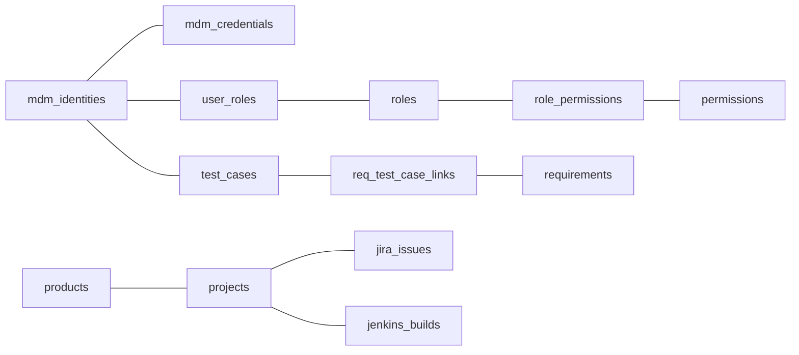

# 📊 DevOps 效能平台 - 数据字典 (Data Dictionary v2.1)

> **生成时间**: 2026-01-01 04:15:00  
> **版本**: v2.1 (模型标准化重构版)  
> **状态**: ✅ 有效 (Active)

---

## 📖 文档说明

本数据字典基于系统最新的 SQLAlchemy ORM 模型自动生成，确保与实际数据库结构的一致性。

**重要提示**: 本文档主要基于 SQLAlchemy ORM 模型及其对应的 **Pydantic V2 (DTO Layer)** 定义。系统采用 `from_attributes=True` 实现零拷贝的自动映射。

**变更历史**:

- **v2.1 (2026-01-01)**: 模型全量标准化重构，适配 Google Python Style Guide，完善所有插件模型定义。
- **v2.0 (2025-12-28)**: 基于最新模型重新生成，废弃旧版数据字典
- **v1.x (已废弃)**: 归档至 `DATA_DICTIONARY_DEPRECATED_20251228.md`

---

## 📋 数据表清单

本系统包含 **60+** 个核心及插件数据表：

### 🏢 核心主数据域 (Core Master Data Domain)
>
> **源文件**: `base_models.py`

| 表名 | 模型类 | 业务描述 |
|:-----|:-------|:---------|
| `mdm_identities` | User | 人员主数据 (OneID)。 |
| `mdm_organizations` | Organization | 组织架构主数据。 |
| `products` | Product | 全局产品模型，支持“产品线 -> 产品”结构。 |
| `services` | Service | 服务目录模型。 |
| `identity_mappings` | IdentityMapping | 跨系统账号映射表。 |
| `sync_logs` | SyncLog | 任务采集同步日志。 |
| `test_execution_summaries` | TestExecutionSummary | 测试执行全量汇总记录。 |
| `labor_rate_configs` | LaborRateConfig | 人工费率与成本标准。 |
| `revenue_contracts` | RevenueContract | 收入合同模型。 |
| `purchase_contracts` | PurchaseContract | 采购合同模型。 |

### 🔐 权限管理域 (Auth & RBAC Domain)
>
> **源文件**: `base_models.py`

| 表名 | 模型类 | 业务描述 |
|:-----|:-------|:---------|
| `roles` | Role | 系统角色表。 |
| `permissions` | Permission | 细粒度功能权限表。 |
| `role_permissions` | RolePermission | 角色与权限关联表。 |
| `user_roles` | UserRole | 用户与角色关联表。 |
| `user_oauth_tokens` | UserOAuthToken | OAuth2 统一认证令牌存储。 |

### 🛠️ 研发工具插件域 (DevOps Tooling Domain)
>
> **源文件**: `plugins/*/models.py`

| 表名 | 模型类 | 业务描述 |
|:-----|:-------|:---------|
| `jira_issues` | JiraIssue | Jira 任务/需求详细模型。 |
| `jenkins_builds` | JenkinsBuild | Jenkins 构建记录详细模型。 |
| `sonar_projects` | SonarProject | SonarQube 代码质量项目模型。 |
| `zentao_products` | ZenTaoProduct | 禅道产品全生命周期模型。 |
| `jfrog_artifacts` | JFrogArtifact | JFrog 制品追溯模型。 |
| `nexus_components` | NexusComponent | Nexus 仓库组件映射模型。 |

### 🧪 测试管理域 (Test Management Domain)
>
> **源文件**: `test_management.py`

| 表名 | 模型类 | 业务描述 |
|:-----|:-------|:---------|
| `test_cases` | TestCase | 结构化测试用例库。 |
| `test_execution_records` | TestExecutionRecord | 单次测试执行明细。 |
| `requirements` | Requirement | 需求模型及其可追溯性关系。 |

### 🎫 服务台域 (Service Desk Domain)
>
> **源文件**: `service_desk.py`

| 表名 | 模型类 | 业务描述 |
|:-----|:-------|:---------|
| `service_desk_tickets` | ServiceDeskTicket | 服务台工单，支持跨部门标签与归责。 |

---

## 🔍 详细字段定义

### 核心主数据表

#### mdm_identities (人员主数据表)

**业务描述**: 人员主数据库 (Master Data Management for Identities)，全局 OneID 唯一身份识别系统。

| 字段名 | 数据类型 | 约束 | 可空 | 默认值 | 说明 |
|:-------|:---------|:-----|:-----|:-------|:-----|
| `global_user_id` | UUID | PK | 否 | uuid_generate_v4() | 全局唯一标识 (OneID) |
| `employee_id` | String(50) | UNIQUE | 是 | - | HR 系统工号 |
| `full_name` | String(200) | | 否 | - | 法律/登记姓名 |
| `primary_email` | String(200) | UNIQUE | 是 | - | 集团办公邮箱 |
| `identity_map` | JSONB | GIN_INDEX | 是 | - | 各工具账号映射 |
| `match_confidence` | Float | | 是 | 1.0 | 语义匹配置信度 |
| `is_active` | Boolean | | 是 | true | 是否在职 |
| `created_at` | DateTime | | 是 | NOW() | 系统录入时间 |
| `updated_at` | DateTime | | 是 | - | 最后更新时间 |

---

#### mdm_organizations (组织主数据表)

**业务描述**: 组织架构主数据 (部门、分公司、项目组等)。

| 字段名 | 数据类型 | 约束 | 可空 | 默认值 | 说明 |
|:-------|:---------|:-----|:-----|:-------|:-----|
| `global_org_id` | UUID | PK | 否 | uuid_generate_v4() | 全局组织 ID |
| `org_code` | String(100) | UNIQUE | 否 | - | 组织编码（如成本中心代码） |
| `org_name` | String(200) | | 否 | - | 组织名称 |
| `org_type` | String(50) | | 是 | - | 组织类型 (department/branch/project) |
| `parent_org_id` | UUID | FK(SELF) | 是 | - | 父级组织 ID（支持树形结构） |
| `manager_user_id` | UUID | FK(mdm_identities) | 是 | - | 部门负责人 ID |
| `level` | Integer | | 是 | - | 组织层级（1=集团，2=分公司，3=部门...） |
| `is_active` | Boolean | | 是 | true | 是否有效 |
| `created_at` | DateTime | | 是 | NOW() | 创建时间 |
| `updated_at` | DateTime | | 是 | - | 更新时间 |

---

#### roles & permissions (RBAC 体系)

**业务描述**: 基于角色的访问控制模型。

| 表名 | 关键字段 | 说明 |
|:-----|:---------|:-----|
| `roles` | `id`, `name`, `code` | 系统定义角色 (如: Admin, PM, Developer)。 |
| `permissions` | `id`, `name`, `code` | 细粒度资源权限 (如: project.read, test.execute)。 |
| `user_roles` | `user_id`, `role_id` | 用户与角色的多对多映射。 |

---

### 测试管理域

#### test_cases (测试用例表)

**业务描述**: 研发效能测试中心的核心用例库。

| 字段名 | 数据类型 | 约束 | 可空 | 默认值 | 说明 |
|:-------|:---------|:-----|:-----|:-------|:-----|
| `id` | Integer | PK | 否 | - | 数据中心自增 ID |
| `project_id` | Integer | FK | 否 | - | 所属 GitLab 技术项目 ID |
| `author_id` | UUID | FK | 否 | - | 编写人 OneID |
| `iid` | Integer | | 否 | - | 工具侧 (GitLab) 内部编号 |
| `title` | String(500) | | 否 | - | 用例简述 |
| `priority` | String(10) | | 是 | 'P2' | 优先级 (P0-P3) |
| `test_type` | String(50) | | 是 | - | 测试类型 (功能/自动/性能) |
| `pre_conditions` | Text | | 是 | - | 前置条件 |
| `test_steps` | JSONB | | 是 | - | 结构化测试步骤序列 |

---

#### requirements (需求模型)

**业务描述**: 核心需求模型，支持 RTM 追溯矩阵。

| 字段名 | 数据类型 | 约束 | 可空 | 默认值 | 说明 |
|:-------|:---------|:-----|:-----|:-------|:-----|
| `id` | Integer | PK | 否 | - | 内部 ID |
| `iid` | Integer | | 否 | - | 工单系统原始 IID |
| `title` | String(500) | | 否 | - | 需求标题 |
| `status` | String(50) | | 是 | - | 流程状态 (draft/closed/resolved) |
| `review_state` | String(50) | | 是 | - | 评审状态 (pending/approved) |

---

### 运维与工具域

#### jira_issues (Jira 任务详情)

**业务描述**: 深度同步 Jira 端任务状态与行为特征。

| 字段名 | 数据类型 | 约束 | 可空 | 说明 |
|:-------|:---------|:-----|:-----|:-----|
| `key` | String(50) | UNIQUE | 否 | Jira 关键字 (如 PROJ-101) |
| `reopening_count` | Integer | | 否 | 任务重开次数 (协作稳定性指标) |
| `time_spent` | BigInteger | | 是 | 实际工时投入 (秒) |
| `original_estimate` | BigInteger | | 是 | 原始预估工时 (秒) |

---

#### service_desk_tickets (服务台工单)

**业务描述**: 跨部门协作服务工单，支持精细化归责。

| 字段名 | 数据类型 | 约束 | 可空 | 说明 |
|:-------|:---------|:-----|:-----|:-----|
| `origin_dept_name` | String(100) | | 是 | 需求发起部门 |
| `target_dept_name` | String(100) | | 是 | 目标响应部门 |
| `status` | String(50) | | 否 | 工单实时状态 |

---

## 📐 数据模型关系图



---

## 🔐 数据治理策略

### 数据安全

- **物理分离**: 账号数据 (`mdm_identities`) 与凭证数据 (`mdm_credentials`) 物理分离。
- **动态脱敏**: 界面展示根据权限级别对 `primary_email` 进行掩码处理。
- **审计追踪**: 除 `created_at` 外，引入 `sync_logs` 对单次采集任务进行闭环审计。

### 数据质量

- **主键唯一性**: 所有表均定义主键约束
- **外键完整性**: 跨表关系通过 FK 约束保证数据一致性
- **乐观锁**: 关键表（如 `mdm_identities`）使用 `sync_version` 防止并发冲突

### 数据生命周期

- **软删除**: 关键业务表使用 `is_active` 标志位，不物理删除
- **历史归档**: 通过 `updated_at` 时间戳支持数据变更历史追踪

---

## 📚 使用指南

### 模型检索策略 (Model Retrieval)

开发者应优先使用 `OneID` (`global_user_id`) 进行多系统关联，避免直接使用 Email 或工号作为关联主键。

### 查询最佳实践

```sql
-- 查询某用户的所有测试用例（含部门过滤）
SELECT tc.* 
FROM test_cases tc
JOIN mdm_identities u ON tc.author_id = u.global_user_id
JOIN mdm_organizations o ON u.XXXX = o.global_org_id  -- 需添加用户-组织关联字段
WHERE u.primary_email = 'user@example.com';

-- 查询需求的测试覆盖率
SELECT r.title, COUNT(rtc.test_case_id) as coverage_count
FROM requirements r
LEFT JOIN requirement_test_case_links rtc ON r.id = rtc.requirement_id
GROUP BY r.id, r.title;
```

### API 集成规范

- **认证方式**: 所有 API 请求必须携带 JWT Bearer Token
- **用户上下文**: 从 Token 解析 `mdm_identities.global_user_id`
- **数据隔离**: 根据用户的部门属性自动过滤数据范围

### Pydantic V2 映射策略

所有 `id` 字段在 DTO 层通过 `validation_alias` 与物理表的 `global_issue_id` 或 `gitlab_issue_iid` 自动绑定。

---

## ⚠️ 注意事项

1. **模型定义为准**: 本文档基于代码自动生成，如有冲突，以 `devops_collector/models/*.py` 为准
2. **定期更新**: 每次模型变更后，请运行 `python scripts/generate_data_dictionary.py` 重新生成
3. **废弃数据**: 旧版数据字典已归档至 `DATA_DICTIONARY_DEPRECATED_20251228.md`
4. **待完善字段**: 部分表可能缺少 `department_id`, `province` 等字段，需根据业务需求补充
5. **Pydantic V2 映射策略**: 所有 `id` 字段在 DTO 层通过 `validation_alias` 与物理表的 `global_issue_id` 或 `gitlab_issue_iid` 自动绑定。

---

**维护者**: DevOps 效能团队  
**最后生成**: 2026-01-01  
**生成规范**: [Google Python Style Guide]
**生成脚本**: `scripts/generate_data_dictionary.py`
