# ⚠️ 数据字典 - 已废弃 (DEPRECATED)

> **废弃日期**: 2025-12-28  
> **状态**: ❌ 已归档 - 请勿使用  
> **替代文档**: [`DATA_DICTIONARY.md`](./DATA_DICTIONARY.md)

---

## 废弃说明

本文件包含的数据字典内容已过时，无法反映系统当前的真实数据模型结构。

**请使用最新版本**: `docs/api/DATA_DICTIONARY.md` (v2.0 企业级标准版)

**废弃原因**:
1. 字段定义与实际模型代码不一致
2. 存在编码损坏导致的内容乱码
3. 缺少最新的 MDM 主数据架构描述
4. 手动维护导致同步滞后

**历史价值**: 本文件作为历史参考归档保留，但不应用于任何开发、运维或文档工作。

---

## 迁移指引

如果您之前依赖本文档，请注意以下变更：

### 表名变更
- `users` → `mdm_identities` (用户主数据)
- `organizations` → `mdm_organizations` (组织主数据)

### 新增核心表
- `user_credentials` (用户凭证表)
- `test_cases` (测试用例表)
- `requirements` (需求表)

### 字段标准化
- 所有用户ID字段统一为 `UUID` 类型
- 时间戳字段统一命名为 `created_at`, `updated_at`
- 外键关联统一使用 `global_user_id`

---

**如有疑问, 请联系DevOps效能团队**

---

# 以下为历史数据字典内容 (仅供参考)

---

# 企业级 DevOps 数据字典 (Enterprise DevOps Data Dictionary)

**版本**: 3.4.0 (PMO & Governance Extension)  
**日期**: 2025-12-20  
**状态**: 已生效 (Active)  
**维护人**: DevOps 效能平台团队

---

## 📖 1. 综述 (Overview)

本文档是 DevOps 数据采集器统一数据模型的唯一事实来源。系统基于 PostgreSQL 构建，采用星型模式设计，通过声明式 SQLAlchemy 模型实现数据的持久化管理。

### 核心架构设计

*   **统一基座 (Unified Base)**: 所有模型继承自统一的 `Base` 类，确保元数据（创建时间、更新时间）的一致性。
*   **统一身份认证 (Centralized Identity)**: 通过 `users` 表实现跨工具（GitLab, SonarQube, Jira, ZenTao）的身份归一化，支持离职员工和外部贡献者的虚拟身份管理。
*   **企业级多租户 (Enterprise Multi-tenancy)**: 依托 `organizations` 表实现 "公司 > 中心 > 部门 > 小组" 四级组织架构管理。

### 全局 ER 关系图

```mermaid
erDiagram
    %% Core Entities
    Organization ||--|{ Organization : "parent/child (父子组织)"
    Organization ||--|{ User : "contains (包含成员)"
    Organization ||--|{ Project : "owns (拥有资产)"
    Organization ||--o{ OKRObjective : "owns (拥有目标)"

    %% User Relationships
    User ||--|{ IdentityMapping : "links (关联外部身份)"
    IdentityMapping }|--|| User : "belongs_to (归属于)"
    
    User ||--|{ Commit : "authors (提交代码)"
    User ||--|{ MergeRequest : "reviews/authors (提交MR)"
    User ||--|{ Issue : "reports (提单)"
    User ||--o{ OKRObjective : "owns (负责OKR)"
    
    %% Jira & ZenTao & Jenkins User Links
    User ||--o{ JiraIssue : "assignee/reporter/creator"
    User ||--o{ ZenTaoIssue : "openedBy/assignedTo"
    User ||--o{ JenkinsBuild : "trigger"
    Project ||--|{ Commit : "contains (包含)"
    Project ||--|{ MergeRequest : "tracks (追踪)"
    Project ||--|{ Issue : "manages (管理)"
    Project ||--|{ Pipeline : "executes (执行)"
    Project ||--|{ Deployment : "deploys (部署)"
    Project ||--o{ Tag : "releases (发布)"
    Project ||--o{ Branch : "has (拥有分支)"
    Project ||--o{ Note : "discussions (讨论)"
    Project ||--o{ ResourceCost : "costs (产生分摊成本)"
    
    %% OKR Models
    Product ||--o{ OKRObjective : "aligns (关联)"
    OKRObjective ||--|{ OKRKeyResult : "measured_by (度量)"
    OKRObjective ||--o{ OKRObjective : "parent/child (层级分解)"

    %% Detail Stats
    Commit ||--|{ CommitFileStats : "details (文件变更明细)"

    %% SonarQube Integration
    Project ||--o| SonarProject : "integrates (集成)"
    SonarProject ||--|{ SonarMeasure : "analyzes (质量快照)"
    SonarProject ||--|{ SonarIssue : "detects (发现问题)"

    %% Jenkins Integration
    Project ||--o{ JenkinsJob : "triggers (触发)"
    JenkinsJob ||--|{ JenkinsBuild : "contains (包含)"

    %% Jira Integration
    Project ||--o{ JiraProject : "manages_agile (敏捷管理)"
    JiraProject ||--|{ JiraBoard : "has (拥有看板)"
    JiraBoard ||--|{ JiraSprint : "contains (包含)"
    JiraProject ||--|{ JiraIssue : "contains (包含)"
    JiraSprint ||--o{ JiraIssue : "groups (归集)"

    JiraIssue ||--o{ JiraIssueHistory : "has_history (变更记录)"
    %% ZenTao Integration
    Project ||--o{ ZenTaoProduct : "tracks_agile (敏捷跟踪)"
    ZenTaoProduct ||--o{ ZenTaoProductPlan : "plans (计划)"
    ZenTaoProduct ||--|{ ZenTaoIssue : "contains (包含)"
    ZenTaoProductPlan ||--o{ ZenTaoIssue : "bins (规划问题)"
    ZenTaoProduct ||--o{ ZenTaoAction : "logged_actions (操作日志)"

    %% FinOps & ROI Integration (New)
    CostCode ||--o{ CostCode : "parent/child (CBS层级)"
    CostCode ||--o{ ResourceCost : "categorizes (分类)"
    Product ||--o{ RevenueContract : "generates (产生收入)"
    RevenueContract ||--|{ ContractPaymentNode : "milestones (收款节点)"
    ContractPaymentNode ||--o| Milestone : "tracks (对应技术里程碑)"
    CostCode ||--o{ PurchaseContract : "links (关联采购)"
    PurchaseContract ||--o{ ResourceCost : "generates (产生流水)"
    LaborRateConfig ||--o{ User : "determines_cost (决定人工单价)"

    %% Agile Flow Analysis (New)
    Issue ||--|{ IssueStateTransition : "tracks_flow (追踪流转)"
    Issue ||--|{ Blockage : "records_blocks (记录阻塞)"
    
    %% OWASP Dependency-Check Integration (New)
    Project ||--|{ DependencyScan : "scans (扫描依赖)"
    DependencyScan ||--|{ Dependency : "contains (包含依赖)"
    Dependency ||--|{ DependencyCVE : "has_vulnerabilities (漏洞)"
    LicenseRiskRule }|--|| Dependency : "evaluates (评估风险)"
```

---

## 🏗️ 2. 公共基础模型 (Common Models)

跨插件共享的核心基础设施表。

### 2.1 组织架构 (`organizations`)
描述企业的层级结构，用于部门效能透视。

| 字段名        | 类型          | 键   | 必填  | 默认值 | 示例数据          | 业务说明                                                                 |
|:--------------|:--------------|:----:|:-----:|:-------|:------------------|:-------------------------------------------------------------------------|
| `id`          | Integer       | PK   | 是    | Auto   | `1001`            | 内部组织 ID (自增)                                                       |
| `name`        | String(200)   |      | 是    | -      | `"研发中心"`      | 组织单元名称                                                             |
| `level`       | String(20)    |      | 否    | -      | `"Center"`        | 层级类型: `Company`(公司), `Center`(中心), `Department`(部门), `Group`(组) |
| `parent_id`   | Integer       | FK   | 否    | NULL   | `1`               | 父级组织 ID (自关联 `organizations.id`)                                  |
| `created_at`  | DateTime      |      | 否    | Now    | `2024-01-01`      | 创建时间                                                                 |
| `updated_at`  | DateTime      |      | 否    | Now    | `2024-01-02`      | 更新时间                                                                 |

### 2.2 全局用户 (`users`)
统一的自然人身份表，作为系统内的唯一身份标识。解决跨系统账号不一致问题。

| 字段名            | 类型          | 键   | 必填  | 默认值 | 示例数据                  | 业务说明                                                 |
|:------------------|:--------------|:----:|:-----:|:-------|:--------------------------|:---------------------------------------------------------|
| `id`              | Integer       | PK   | 是    | Auto   | `10086`                   | 全局用户 ID                                              |
| `username`        | String(100)   | UK   | 是    | -      | `"zhangsan"`              | 内部唯一用户名                                           |
| `name`            | String(200)   |      | 否    | -      | `"张三"`                  | 显示名称 (中文名)                                        |
| `email`           | String(200)   | UK   | 否    | -      | `"zhangsan@corp.com"`     | 企业邮箱 (用于跨源自动对齐的关键字段)                   |
| `employee_id`     | String(50)    |      | 否    | -      | `"EMP001"`                | **工号 (HR 系统关联)**                                   |
| `job_title_level` | String(50)    |      | 否    | -      | `"P3/Senior"`             | **职级/岗位 (用于计算人工费率)**                         |
| `hire_date`       | Date          |      | 否    | -      | `2020-01-01`              | **入职日期 (计算在岗周期)**                              |
| `termination_date`| Date          |      | 否    | -      | `2024-12-31`              | **离职日期**                                             |
| `state`           | String(20)    |      | 否    | active | `"active"`                | 账号状态: `active`(激活), `blocked`(禁用)                |
| `department`      | String(100)   |      | 否    | -      | `"基础架构部"`            | 归属部门名称快照                                         |
| `organization_id` | Integer       | FK   | 否    | NULL   | `2001`                    | 关联组织 ID (外键 `organizations.id`)                    |
| `password_hash`   | String(200)   |      | 否    | -      | `"$2b$12$..."`            | **加密密码 (Bcrypt)**                                    |
| `raw_data`        | JSON          |      | 否    | -      | `{"id": 888, ...}`        | 原始数据备份                                             |

### 2.3 身份映射 (`identity_mappings`)
建立基础工具账号（Jira, ZenTao, GitLab 等）与全局用户之间的映射关系。实现一见多、跨系统识别。

| 字段名            | 类型          | 键   | 必填  | 默认值 | 示例数据                  | 业务说明                                                 |
|:------------------|:--------------|:----:|:-----:|:-------|:--------------------------|:---------------------------------------------------------|
| `id`              | Integer       | PK   | 是    | Auto   | `1`                       | 映射 ID                                                   |
| `user_id`         | Integer       | FK   | 是    | -      | `10086`                   | 全局用户 ID (外键 `users.id`)                            |
| `source`          | String(50)    | UK1  | 是    | -      | `"jira"`                  | 来源系统 (jira, zentao, gitlab, jenkins, sonarqube)      |
| `external_id`     | String(200)   | UK1  | 是    | -      | `"jira_acc_001"`          | 外部系统中的账号标识 (如 accountId 或 account)           |
| `external_name`   | String(200)   |      | 否    | -      | `"张三(Jira)"`            | 该系统中的显示名称                                       |
| `email`           | String(200)   |      | 否    | -      | `"zhangsan@corp.com"`     | 该账号记录的邮箱 (辅助对齐)                              |
| `created_at`      | DateTime      |      | 否    | Now    | `2024-01-01`              | 创建时间                                                 |

#### 2.3.1 预定义映射策略
*   **GitLab 特色策略**: 
    *   **字段映射**: 提取 GitLab User Profile 中的 `skype` (或 `skypeid`) 字段。
    *   **组织关联**: 该字段值被视为 **Center (部门中心)** 名称，系统会自动在 `organizations` 表中寻找或创建 `level='Center'` 的归属组织。
    *   **身份对齐**: 优先通过 GitLab ID 匹配，其次通过 Email 对齐现有全局用户。
*   **Jira 特色策略**: 通过 `accountId` 作为唯一标识。
*   **ZenTao 特色策略**: 通过 `account` 作为唯一标识。
*   **标准化标签定义 (New)**:
    *   **资源分离**: 平台核心标签（type, priority, severity 等）统一由 `devops_collector/plugins/gitlab/labels.py` 定义。
    *   **自动化对齐**: 客户端工具（如 `check_issue_labels.py`）动态引用该库进行 Issue 规范性校验，确保跨项目的元数据一致性。

### 2.4 产品与产品线 (`products`)
全局产品管理，用于串联业务架构与技术项目。

| 字段名            | 类型          | 键   | 必填  | 默认值 | 业务说明                                                 |
|:------------------|:--------------|:----:|:-----:|:-------|:---------------------------------------------------------|
| `id`              | Integer       | PK   | 是    | Auto   | 全局产品 ID                                               |
| `name`            | String(200)   |      | 是    | -      | 产品/产品线名称                                           |
| `description`     | Text          |      | 否    | -      | 描述                                                     |
| `level`           | String(20)    |      | 否    | -      | 层级 (`Line` 或 `Product`)                                |
| `parent_id`       | Integer       | FK   | 否    | -      | 父节点 ID (用于产品线归属)                                |
| `product_line_name`| String(200)  |      | 否    | -      | 归属产品线名称 (冗余)                                     |
| `organization_id` | Integer       | FK   | 否    | -      | 归属组织中心 ID                                           |
| `project_id`      | Integer       |      | 否    | -      | 关联的技术项目 ID (由插件具体定义)                        |
| `external_epic_id` | String    |      | 否    | -      | **关联外部系统 Epic/需求 ID (Jira/ZenTao)**              |
| `external_goal_id` | String    |      | 否    | -      | **关联外部战略目标/OKR ID**                              |
| `source_system`    | String    |      | 否    | -      | **来源系统: `jira`, `zentao`**                           |
| `product_manager_id`| Integer     | FK   | 否    | -      | 产品经理 (关联 `users.id`)                               |
| `dev_manager_id`  | Integer       | FK   | 否    | -      | 开发经理 (关联 `users.id`)                               |
| `test_manager_id` | Integer       | FK   | 否    | -      | 测试经理 (关联 `users.id`)                               |
| `release_manager_id`| Integer     | FK   | 否    | -      | 发布经理 (关联 `users.id`)                               |
| `budget_amount`   | Float         |      | 否    | -      | **预算金额 (用于 ROI 分析)**                             |
| `business_value_score`| Integer    |      | 否    | -      | **业务价值评分 (1-100)**                                 |

### 2.5 OKR 目标管理 (`okr_objectives`) (New)
记录战略高度的业务目标，支持双向对齐与层级拆解。

| 字段名            | 类型          | 键   | 必填  | 默认值 | 业务说明                                                 |
|:------------------|:--------------|:----:|:-----:|:-------|:---------------------------------------------------------|
| `id`              | Integer       | PK   | 是    | Auto   | 目标 ID                                                   |
| `title`           | String        |      | 是    | -      | 目标名称 (Objective)                                     |
| `owner_id`        | Integer       | FK   | 是    | -      | 责任人 (关联 `users.id`)                                 |
| `organization_id` | Integer       | FK   | 否    | -      | 归属组织 (关联 `organizations.id`)                        |
| `product_id`      | Integer       | FK   | 否    | -      | 关联产品 (关联 `products.id`)                             |
| `period`          | String        |      | 否    | -      | 周期 (如 `2024-Q4`)                                      |
| `status`          | String        |      | 否    | `draft`| 状态: `draft`, `active`, `achieved`, `closed`            |
| `parent_id`       | Integer       | FK   | 否    | -      | 父目标 ID (用于战略分解)                                 |

### 2.6 OKR 关键结果 (`okr_key_results`) (New)
定义量化指标，衡量目标达成进度。

| 字段名            | 类型          | 键   | 必填  | 默认值 | 业务说明                                                 |
|:------------------|:--------------|:----:|:-----:|:-------|:---------------------------------------------------------|
| `id`              | Integer       | PK   | 是    | Auto   | KR ID                                                    |
| `objective_id`    | Integer       | FK   | 是    | -      | 关联目标 ID (关联 `okr_objectives.id`)                    |
| `title`           | String        |      | 是    | -      | 关键结果描述                                             |
| `initial_value`   | String        |      | 否    | -      | 初始值                                                   |
| `target_value`    | String        |      | 是    | -      | 目标值                                                   |
| `current_value`   | String        |      | 否    | -      | 当前实际值                                               |
| `metric_unit`     | String        |      | 否    | -      | 单位 (%, 天, 个等)                                       |
| `progress`        | Integer       |      | 否    | 0      | 进度百分比 (0-100)                                       |
| `linked_metrics_config`| JSON     |      | 否    | -      | **自动化度量配置 (关联 SQL/API 指标)**                   |

### 2.7 资源与成本 (`resource_costs`) (New)
记录财务维度的投入数据，支持 FinOps 与 ROI 分析。

| 字段名            | 类型          | 键   | 必填  | 默认值 | 业务说明                                                 |
|:------------------|:--------------|:----:|:-----:|:-------|:---------------------------------------------------------|
| `id`              | Integer       | PK   | 是    | Auto   | 记录 ID                                                  |
| `project_id`      | Integer       | FK   | 否    | -      | 关联项目 ID                                              |
| `product_id`      | Integer       | FK   | 否    | -      | 关联产品 ID                                              |
| `organization_id` | Integer       | FK   | 否    | -      | 关联组织 ID                                              |
| `cost_code_id`    | Integer       | FK   | 否    | -      | **关联财务科目 ID (外键 `cost_codes.id`)**               |
| `purchase_contract_id`| Integer   | FK   | 否    | -      | **关联采购合同 ID (用于分摊溯源)**                       |
| `period`          | String        |      | 是    | -      | 周期 (如 `2025-01`)                                      |
| `cost_type`       | String        |      | 是    | -      | 成本分类: `Infrastructure`, `HumanLabor`, `Licensing`    |
| `cost_item`       | String        |      | 否    | -      | 具体名目 (如 `AWS-EC2`, `StaffSalaray`)                  |
| `amount`          | Float         |      | 是    | -      | 金额                                                     |
| `currency`        | String        |      | 否    | `CNY`  | 币种                                                     |
| `capex_opex_flag` | String(10)    |      | 否    | -      | **CAPEX/OPEX 标识**                                      |
| `is_locked`       | Boolean       |      | 否    | False  | **财务结账锁定标识 (禁止修改)**                          |
| `accounting_date` | Date          |      | 否    | -      | **入账日期**                                             |
| `source_system`   | String        |      | 否    | -      | 数据来源: `aws_billing`, `hr_system`, `manual`           |

### 2.8 链路追溯关系 (`traceability_links`) (New)
存储跨系统、跨实体的逻辑链接关系。

| 字段名            | 类型          | 键   | 必填  | 默认值 | 业务说明                                                 |
|:------------------|:--------------|:----:|:-----:|:-------|:---------------------------------------------------------|
| `id`              | Integer       | PK   | 是    | Auto   | 链路 ID                                                  |
| `source_system`   | String        |      | 是    | -      | 源系统 (jira, zentao, gitlab...)                         |
| `source_id`       | String        |      | 是    | -      | 源实体 ID                                                |
| `target_system`   | String        |      | 是    | -      | 目标系统 (gitlab, jenkins...)                            |
| `target_id`       | String        |      | 是    | -      | 目标实体 ID                                              |
| `link_type`       | String        |      | 否    | -      | 关系类型: `fixes`, `relates_to`, `implements`            |

### 2.9 同步日志 (`sync_logs`)
数据采集任务的审计追踪。

| 字段名             | 类型         | 键   | 必填  | 默认值   | 示例数据             | 业务说明                         |
|:-------------------|:-------------|:----:|:-----:|:---------|:---------------------|:---------------------------------|
| `id`               | Integer      | PK   | 是    | Auto     | `500`                | 日志 ID                          |
| `source`           | String(20)   |      | 否    | 'gitlab' | `"gitlab"`           | 数据源: `gitlab`, `sonarqube`    |
| `project_id`       | Integer      |      | 否    | -        | `12345`              | 关联的项目内部 ID                |
| `project_key`      | String(200)  |      | 否    | -        | `"com.corp:demo"`    | 项目标识 Key (Sonar 用)          |
| `status`           | String(20)   |      | 否    | -        | `"SUCCESS"`          | 任务状态: `SUCCESS`, `FAILED`    |
| `duration_seconds` | Integer      |      | 否    | -        | `45`                 | 耗时 (秒)                        |
| `records_synced`   | Integer      |      | 否    | -        | `120`                | 同步条数                         |
| `timestamp`        | DateTime     |      | 否    | Now      | `2025-12-14 10:00`   | 执行时间                         |

### 2.10 原始数据暂存层 (`raw_data_staging`) 🌟 (New)
用于 ETL 的 Extract 阶段，存储来自各源系统的原始 JSON 响应，支持数据审计、全量回刷与排障。

| 字段名          | 类型          | 键   | 必填  | 默认值 | 示例数据                  | 业务说明                                                                 |
|:--------------|:--------------|:----:|:-----:|:-------|:--------------------------|:-------------------------------------------------------------------------|
| `id`          | BigInteger    | PK   | 是    | Auto   | `1`                       | 自增 ID                                                                  |
| `source`      | String(50)    | UK1  | 是    | -      | `"gitlab"`                | 数据源: `gitlab`, `jira`, `zentao`, `jenkins`, `sonarqube`, `jfrog`, `nexus` |
| `entity_type` | String(50)    | UK1  | 是    | -      | `"merge_request"`         | 实体类型                                                                 |
| `external_id` | String(255)   | UK1  | 是    | -      | `"!101"`                  | 外部系统 ID                                                              |
| `payload`     | JSONB         |      | 是    | -      | `{"id": 101, ...}`        | 原始 API 响应内容                                                        |
| `schema_version`| String(20)    |      | 否    | `"1.0"`| `"1.1"`                   | 原始 JSON 的 Schema 版本 (如 GitLab v1.1)，用于解析多样性                 |
| `collected_at`| DateTime      |      | 否    | Now    | `2025-12-20 12:00`        | 采集时间 (带时区)                                                        |

#### 2.10.1 关键特性
*   **非破坏性更新**: 使用 `ON CONFLICT (source, entity_type, external_id) DO UPDATE` 确保最新。
*   **生存周期 (TTL)**: 受 `RAW_DATA_RETENTION_DAYS` 配置控制，由 `RetentionManager` 自动清理。
*   **重放支持**: 支持在不触发外部 API 请求的情况下，通过更改 Transform 逻辑并读取此表进行“数据回刷”。

### 2.11 财务成本科目 (`cost_codes`) 🌟 (New)
定义组织级的成本拆解结构 (CBS Tree)。

| 字段名         | 类型          | 键   | 必填  | 业务说明                                      |
|:---------------|:--------------|:----:|:-----:|:----------------------------------------------|
| `id`           | Integer       | PK   | 是    | 科目自增 ID                                   |
| `code`         | String(50)    | UK   | 是    | 财务科目代码 (如 1001.01)                     |
| `name`         | String(200)   |      | 是    | 科目名称                                      |
| `parent_id`    | Integer       | FK   | 否    | 父级科目 ID (自关联)                          |
| `category`     | String(50)    |      | 否    | 大类: `Labor`, `Infrastructure`, `License`    |
| `default_capex_opex`| String(10)|      | 否    | 默认资本化/费用化建议 (CAPEX/OPEX)            |
| `is_active`    | Boolean       |      | 否    | 是否启用                                      |

### 2.12 收入合同 (`revenue_contracts`) 🌟 (New)
记录外部商务合同元数据，支持 ROI 分析的“产出”维度。

| 字段名         | 类型          | 键   | 必填  | 业务说明                         |
|:---------------|:--------------|:----:|:-----:|:---------------------------------|
| `id`           | Integer       | PK   | 是    | 合同 ID                          |
| `contract_no`  | String(100)   | UK   | 是    | 外部合同编号                     |
| `title`        | String(500)   |      | 是    | 合同标题                         |
| `total_value`  | Float         |      | 是    | 合同总金额                       |
| `product_id`   | Integer       | FK   | 否    | 关联产品 ID                      |
| `sign_date`    | Date          |      | 否    | 签署日期                         |

### 2.13 合同收款节点 (`contract_payment_nodes`) 🌟 (New)
将财务回款计划（如 3-4-3 比例）与技术系统里程碑 (GitLab Milestone) 挂钩。

| 字段名                | 类型         | 键   | 必填  | 业务说明                                         |
|:----------------------|:-------------|:----:|:-----:|:-------------------------------------------------|
| `id`                  | Integer      | PK   | 是    | 节点 ID                                          |
| `contract_id`         | Integer      | FK   | 是    | 关联收入合同 ID                                  |
| `node_name`           | String(200)  |      | 是    | 节点名称 (如“首付款”、“验收款”)                 |
| `billing_percentage`  | Float        |      | 是    | 计费百分比 (%)                                   |
| `billing_amount`      | Float        |      | 是    | 预计收款金额                                     |
| `linked_system`       | String(50)   |      | 否    | 触发系统: `gitlab`, `manual`                     |
| `linked_milestone_id`| Integer       |      | 否    | **映射的 GitLab 里程碑 ID**                      |
| `is_achieved`         | Boolean      |      | 否    | 是否已达成 (基于里程碑状态或人工确认)           |
| `achieved_at`         | DateTime     |      | 否    | 达成时间                                         |

### 2.14 采购合同 (`purchase_contracts`) 🌟 (New)
记录支出类合同，用于分摊云成本或外包成本。

| 字段名         | 类型          | 键   | 必填  | 业务说明                         |
|:---------------|:--------------|:----:|:-----:|:---------------------------------|
| `id`           | Integer       | PK   | 是    | 采购合同 ID                      |
| `contract_no`  | String(100)   | UK   | 是    | 采购号                           |
| `vendor_name`  | String(200)   |      | 否    | 供应商名称                       |
| `total_amount` | Float         |      | 是    | 合同总额                         |
| `cost_code_id` | Integer       | FK   | 否    | 归属财务科目                     |

### 2.15 人工费率配置 (`labor_rate_configs`) 🌟 (New)
建立职级与标准人天成本的映射。

| 字段名             | 类型         | 键   | 必填  | 业务说明                                      |
|:-------------------|:-------------|:----:|:-----:|:----------------------------------------------|
| `id`               | Integer      | PK   | 是    | ID                                            |
| `job_title_level`  | String(50)   | UK   | 是    | 职级/岗位名称 (如 P3, Dev)                    |
| `daily_rate`       | Float        |      | 是    | **标准人天费率 (Blended Rate)**               |
| `hourly_rate`      | Float        |      | 否    | 标准人时费率                                  |
| `is_active`        | Boolean      |      | 否    | 是否生效                                      |

---

## 🦊 3. GitLab 数据域 (GitLab Domain)

覆盖研发全生命周期：计划 -> 编码 -> 构建 -> 部署。

### 3.1 群组 (`gitlab_groups`) (New)
GitLab 的组织单元，用于管理项目和子群组。

| 字段名        | 类型          | 键   | 必填  | 默认值 | 示例数据                  | 业务说明                                   |
|:--------------|:--------------|:----:|:-----:|:-------|:--------------------------|:-------------------------------------------|
| `id`          | Integer       | PK   | 是    | -      | `99`                      | **GitLab Group ID**                        |
| `name`        | String(255)   |      | 是    | -      | `"Backend Team"`          | 群组名称                                   |
| `path`        | String(255)   |      | 是    | -      | `"backend"`               | URL 路径片段                               |
| `full_path`   | String(500)   | UK   | 是    | -      | `"tech/backend"`          | 完整路径                                   |
| `description` | Text          |      | 否    | -      | `"后端研发部"`            | 描述信息                                   |
| `parent_id`   | Integer       | FK   | 否    | NULL   | `88`                      | 父群组 ID (自关联 `gitlab_groups.id`)      |
| `visibility`  | String(20)    |      | 否    | -      | `"private"`               | 可见性: `public`, `private`, `internal`    |
| `avatar_url`  | String(500)   |      | 否    | -      | `"http://..."`            | 图标                                       |
| `web_url`     | String(500)   |      | 否    | -      | `"http://gitlab.../tech"` | Web 地址                                   |
| `created_at`  | DateTime      |      | 否    | -      | `2024-01-01`              | 创建时间                                   |
| `updated_at`  | DateTime      |      | 否    | -      | `2024-01-02`              | 更新时间                                   |

### 3.2 群组成员 (`gitlab_group_members`) (New)
记录用户与群组的关联权限，用于安全审计和人力管理。

| 字段名         | 类型         | 键      | 必填  | 默认值 | 示例数据      | 业务说明                                      |
|:---------------|:-------------|:-------:|:-----:|:-------|:--------------|:----------------------------------------------|
| `id`           | Integer      | PK      | 是    | Auto   | `555`         | 记录 ID                                       |
| `group_id`     | Integer      | FK      | 是    | -      | `99`          | 关联群组 ID (关联 `gitlab_groups.id`)         |
| `user_id`      | Integer      | FK      | 是    | -      | `10086`       | 关联系统用户 ID (关联 `users.id`)             |
| `gitlab_uid`   | Integer      |         | 是    | -      | `888`         | 原始 GitLab User ID (用于匹配)                |
| `access_level` | Integer      |         | 是    | -      | `30`          | 权限值: 10(Guest), 30(Dev), 40(Maintainer), 50(Owner) |
| `state`        | String(20)   |         | 否    | -      | `"active"`    | 状态: `active`, `awaiting`, `invited`         |
| `joined_at`    | DateTime     |         | 否    | -      | `2024-01-01`  | 加入时间                                      |
| `expires_at`   | DateTime     |         | 否    | NULL   | `2024-12-31`  | 权限过期时间 (外包/临时权限常用)              |

### 3.3 项目 (`projects`)
研发资产的核心容器。

| 字段名                | 类型         | 键   | 必填  | 默认值     | 示例数据                    | 业务说明                                         |
|:----------------------|:-------------|:----:|:-----:|:-----------|:----------------------------|:-------------------------------------------------|
| `id`                  | Integer      | PK   | 是    | -          | `1010`                      | **GitLab 原始 Project ID** (保留原值以简化关联)  |
| `name`                | String       |      | 否    | -          | `"DevOps Platform"`         | 项目名称                                         |
| `path_with_namespace` | String       |      | 否    | -          | `"infra/devops-platform"`   | 完整路径 (如 `group/subgroup/project`)           |
| `department`          | String       |      | 否    | -          | `"效能工具组"`              | 部门 (从顶层 Group 描述字段解析)                 |
| `group_id`            | Integer      | FK   | 否    | NULL       | `99`                        | **归属群组 ID** (关联 `gitlab_groups.id`)        |
| `organization_id`     | Integer      | FK   | 否    | NULL       | `1001`                      | 归属组织 (关联 `organizations.id`)               |
| `sync_status`         | String       |      | 否    | 'PENDING'  | `"COMPLETED"`               | 同步状态机: `PENDING`, `SYNCING`, `COMPLETED`    |
| `storage_size`        | BigInteger   |      | 否    | -          | `104857600`                 | 仓库物理大小 (Bytes)                             |
| `star_count`          | Integer      |      | 否    | -          | `56`                        | 关注数                                           |
| `forks_count`         | Integer      |      | 否    | -          | `12`                        | 复刻数                                           |
| `visibility`          | String       |      | 否    | -          | `"private"`                 | 可见性 (public/internal/private)                 |
| `archived`            | Boolean      |      | 否    | False      | `True`                      | 是否归档 (True=已归档)                           |

### 3.2 提交 (`commits`)
代码变更的历史记录。

| 字段名           | 类型      | 键      | 必填  | 默认值 | 示例数据                  | 业务说明                           |
|:-----------------|:----------|:-------:|:-----:|:-------|:--------------------------|:-----------------------------------|
| `id`             | String    | PK      | 是    | -      | `"a1b2c3d4..."`           | Commit SHA 哈希值                  |
| `project_id`     | Integer   | PK, FK  | 是    | -      | `1010`                    | 归属项目 ID (复合主键)             |
| `short_id`       | String    |         | 否    | -      | `"a1b2c3d4"`              | 短 SHA (前8位)                     |
| `title`          | String    |         | 否    | -      | `"feat: add new api"`     | 提交标题                           |
| `author_name`    | String    |         | 否    | -      | `"Zhang San"`             | Git 提交人姓名                     |
| `author_email`   | String    |         | 否    | -      | `"zhangsan@corp.com"`     | Git 提交人邮箱                     |
| `committed_date` | DateTime  |         | 否    | -      | `2024-01-15 14:30`        | 提交时间                           |
| `additions`      | Integer   |         | 否    | -      | `150`                     | 增加行数                           |
| `deletions`      | Integer   |         | 否    | -      | `20`                      | 删除行数                           |
| `total`          | Integer   |         | 否    | -      | `170`                     | 变更总行数                         |
| `is_off_hours`   | Boolean   |         | 否    | False  | `True`                    | **加班提交标识** (20:00-08:00/周末)|
| `lint_status`    | String(20)|         | 否    | NULL   | `"passed"`                | **代码规范状态**                   |
| `ai_category`    | String(50)|         | 否    | -      | `"Refactor"`              | **AI 自动分类 (Feature/Bug/Refactor)** |
| `ai_summary`     | Text      |         | 否    | -      | `"优化用户登录查询性能"`  | **AI 生成的业务价值摘要**          |
| `ai_confidence`  | Float     |         | 否    | -      | `0.95`                    | **AI 分类置信度**                  |
| `gitlab_user_id` | Integer   | FK      | 否    | NULL   | `10086`                   | 关联内部用户 ID (关联 `users.id`)  |

### 3.3 提交文件统计 (`commit_file_stats`) 🌟
每次提交中每个文件的变更明细，用于精准识别有效代码产出。

| 字段名          | 类型      | 键   | 必填  | 默认值 | 示例数据               | 业务说明           |
|:----------------|:----------|:----:|:-----:|:-------|:-----------------------|:-------------------|
| `id`            | Integer   | PK   | 是    | Auto   | `50001`                | 自增 ID            |
| `commit_id`     | String    | FK   | 否    | -      | `"a1b2c3d4..."`        | 关联 Commit SHA    |
| `file_path`     | String    |      | 否    | -      | `"src/main.py"`        | 变更文件路径       |
| `language`      | String    |      | 否    | -      | `"Python"`             | 编程语言类型       |
| `file_type_category`| String |     | 否    | -      | `"Code"`               | **文件分类: `Code`, `Test`, `IaC`, `Config`** |
| `code_added`    | Integer   |      | 否    | 0      | `50`                   | **代码**增加行数   |
| `comment_added` | Integer   |      | 否    | 0      | `10`                   | **注释**增加行数   |
| `blank_added`   | Integer   |      | 否    | 0      | `5`                    | **空行**增加行数   |

### 3.4 合并请求 (`merge_requests`)
代码评审 (Code Review) 过程记录。

| 字段名          | 类型      | 键   | 必填  | 默认值 | 示例数据                   | 业务说明                         |
|:----------------|:----------|:----:|:-----:|:-------|:---------------------------|:---------------------------------|
| `id`            | Integer   | PK   | 是    | -      | `2050`                     | GitLab MR 全局 ID                |
| `iid`           | Integer   |      | 否    | -      | `15`                       | 项目内 MR 编号 (如 !15)          |
| `project_id`    | Integer   | FK   | 否    | -      | `1010`                     | 归属项目                         |
| `title`         | String    |      | 否    | -      | `"Refactor user model"`    | 标题                             |
| `state`         | String    |      | 否    | -      | `"merged"`                 | 状态: `opened`, `merged`, `closed`|
| `author_id`     | Integer   | FK   | 否    | -      | `10086`                    | 发起人 (关联 `users.id`)         |
| `created_at`    | DateTime  |      | 否    | -      | `2024-02-01 09:00`         | 创建时间                         |
| `merged_at`     | DateTime  |      | 否    | NULL   | `2024-02-02 18:00`         | 合并时间 (计算 Review 耗时)      |
| `changes_count` | String    |      | 否    | -      | `"10"`                     | 变更文件数                       |
| `review_cycles` | Integer   |      | 否    | 1      | `3`                        | **评审轮次 (打回修订次数)**      |
| `approval_count`| Integer   |      | 否    | 0      | `2`                        | **审批成功人数**                 |
| `human_comment_count`| Integer |    | 否    | 0      | `12`                       | **人工有效评论数**               |
| `review_time_total`| BigInteger |   | 否    | -      | `43200`                    | **总评审耗时 (秒)**              |
| `quality_gate_status`| String(20)|   | 否    | -      | `"passed"`                 | **质量门禁结果**                 |
| `ai_category`    | String(50)|         | 否    | -      | `"Feature"`               | **AI 需求分类**                  |
| `ai_summary`     | Text      |         | 否    | -      | `"实现多因素认证登录"`    | **AI 业务价值总结**              |
| `author_id`     | Integer   | FK   | 否    | -      | `10086`                    | 关联内部用户 ID (关联 `users.id`) |

### 3.5 议题 (`issues`)
需求与缺陷管理。

| 字段名             | 类型      | 键   | 必填  | 默认值 | 示例数据                  | 业务说明                         |
|:-------------------|:----------|:----:|:-----:|:-------|:--------------------------|:---------------------------------|
| `id`               | Integer   | PK   | 是    | -      | `3050`                    | Issue 全局 ID                    |
| `iid`              | Integer   |      | 否    | -      | `102`                     | 项目内编号 (如 #102)             |
| `project_id`       | Integer   | FK   | 否    | -      | `1010`                    | 归属项目                         |
| `title`            | String    |      | 否    | -      | `"Fix login bug"`         | 标题                             |
| `time_estimate`    | Integer   |      | 否    | NULL   | `3600`                    | 预估工时 (秒)                    |
| `total_time_spent` | Integer   |      | 否    | NULL   | `7200`                    | 实际耗时 (秒)                    |
| `weight`           | Integer   |      | 否    | NULL   | `5`                       | **敏捷权重 (Story Points)**      |
| `work_item_type`   | String(50)|      | 否    | -      | `"issue"`                 | **工作项类型 (Issue, Task, Bug)**|
| `ai_category`    | String(50)|         | 否    | -      | `"Refactor"`              | **AI 智能分类**                  |
| `ai_summary`     | Text      |         | 否    | -      | `"底层存储架构重构"`      | **AI 产出摘要**                  |
| `author_id`        | Integer   | FK   | 否    | -      | `10086`                   | 提单人 (关联 `users.id`)         |
| `labels`           | JSON      |      | 否    | -      | `["bug", "P0"]`           | 标签集合                         |
| `state`            | String    |      | 否    | -      | `"closed"`                | 状态: `opened`, `closed`         |
| `created_at`       | DateTime  |      | 否    | -      | `2024-02-01`              | 创建时间                         |
| `closed_at`        | DateTime  |      | 否    | NULL   | `2024-02-05`              | 关闭时间 (用于计算 MTTR)         |
| `user_notes_count` | Integer   |      | 否    | 0      | `5`                       | **人工评论总数 (用于争议度分析)**|

### 3.6 议题变更事件 (`gitlab_issue_events`) 🌟 (New)
用于 CALMS 文化与精益扫描，追踪 Issue 的状态流转、标签变动等历史。

| 字段名             | 类型      | 键   | 必填  | 默认值 | 示例数据                  | 业务说明                                         |
|:-------------------|:----------|:----:|:-----:|:-------|:--------------------------|:-------------------------------------------------|
| `id`               | Integer   | PK   | 是    | Auto   | `10001`                   | 内部自增 ID                                      |
| `issue_id`         | Integer   | FK   | 是    | -      | `3050`                    | 关联 Issue ID (关联 `issues.id`)                 |
| `user_id`          | Integer   | FK   | 否    | NULL   | `10086`                   | 执行人 (关联 `users.id`)                         |
| `event_type`       | String    |      | 是    | -      | `"state"`                 | 事件类型: `state`, `label`, `milestone`          |
| `action`           | String    |      | 是    | -      | `"closed"`                | 具体动作: `closed`, `reopened`, `add`, `remove`  |
| `external_event_id`| Integer   |      | 否    | -      | `556677`                  | GitLab 原始事件 ID                               |
| `meta_info`        | JSON      |      | 否    | -      | `{"label": {"id": 1}...}` | 原始事件数据 (含变更详情)                        |
| `created_at`       | DateTime  |      | 是    | -      | `2024-03-05 10:00`        | 事件发生时间                                     |

### 3.6 讨论笔记 (`notes`)
MR 和 Issue 中的评论互动。

| 字段名          | 类型      | 键   | 必填  | 默认值 | 示例数据                  | 业务说明                                      |
|:----------------|:----------|:----:|:-----:|:-------|:--------------------------|:----------------------------------------------|
| `id`            | Integer   | PK   | 是    | -      | `8001`                    | Note ID                                       |
| `noteable_type` | String    |      | 否    | -      | `"MergeRequest"`          | 对象类型: `MergeRequest`, `Issue`             |
| `noteable_iid`  | Integer   |      | 否    | -      | `15`                      | 对象项目内编号                                |
| `body`          | String    |      | 否    | -      | `"Please fix lint error"` | 评论内容                                      |
| `system`        | Boolean   |      | 否    | False  | `False`                   | 是否系统消息 (True=系统生成, False=人工评论)  |
| `resolvable`    | Boolean   |      | 否    | False  | `True`                    | 是否需要在此处打钩解决 (用于 CR 统计)         |

### 3.7 流水线 (`pipelines`)
CI/CD 持续集成执行记录。

| 字段名       | 类型      | 键   | 必填  | 默认值 | 示例数据             | 业务说明                        |
|:-------------|:----------|:----:|:-----:|:-------|:---------------------|:--------------------------------|
| `id`         | Integer   | PK   | 是    | -      | `9001`               | Pipeline ID                     |
| `project_id` | Integer   | FK   | 否    | -      | `1010`               | 归属项目                        |

### 3.14 议题状态流转 (`issue_state_transitions`) 🌟 (New)
追踪 Issue 在不同状态间的流转轨迹，用于 Cycle Time 分析。

| 字段名             | 类型      | 键   | 必填  | 业务说明                         |
|:-------------------|:----------|:----:|:-----:|:---------------------------------|
| `id`               | Integer   | PK   | 是    | ID                               |
| `issue_id`         | Integer   | FK   | 是    | 关联 Issue ID                    |
| `from_state`       | String    |      | 是    | 起始状态                         |
| `to_state`         | String    |      | 是    | 目标状态                         |
| `timestamp`        | DateTime  |      | 是    | 流转时间                         |
| `duration_hours`   | Float     |      | 否    | **在此状态停留时长 (小时)**      |

### 3.15 议题阻塞记录 (`issue_blockages`) 🌟 (New)
由 'blocked' 标签触发的阻塞区间记录。

| 字段名             | 类型      | 键   | 必填  | 业务说明                         |
|:-------------------|:----------|:----:|:-----:|:---------------------------------|
| `id`               | Integer   | PK   | 是    | ID                               |
| `issue_id`         | Integer   | FK   | 是    | 关联 Issue ID                    |
| `reason`           | String    |      | 否    | 阻塞原因 (标签名)                |
| `start_time`       | DateTime  |      | 是    | 阻塞开始时间                     |
| `end_time`         | DateTime  |      | 否    | 阻塞解除时间 (NULL 代表进行中)   |
| `status`     | String    |      | 否    | -      | `"success"`          | 状态: `success`, `failed`, `canceled` |
| `duration`   | Integer   |      | 否    | -      | `300`                | 运行时长 (秒)                   |
| `coverage`   | String    |      | 否    | NULL   | `"85.4"`             | 单元测试覆盖率 (如 "85.4")      |
| `source`     | String    |      | 否    | -      | `"push"`             | 触发源 (如 `push`, `schedule`)  |

### 3.8 部署 (`deployments`)
DORA 指标核心数据源，记录发布行为。

| 字段名        | 类型      | 键   | 必填  | 默认值 | 示例数据             | 业务说明                     |
|:--------------|:----------|:----:|:-----:|:-------|:---------------------|:-----------------------------|
| `id`          | Integer   | PK   | 是    | -      | `4001`               | Deployment ID                |
| `project_id`  | Integer   | FK   | 否    | -      | `1010`               | 归属项目                     |
| `environment` | String    |      | 否    | -      | `"production"`       | 环境名称 (如 `production`)   |
| `status`      | String    |      | 否    | -      | `"success"`          | 部署结果                     |
| `created_at`  | DateTime  |      | 否    | -      | `2024-03-01 12:00`   | 部署时间                     |
| `ref`         | String    |      | 否    | -      | `"main"`             | 部署分支/Tag                 |

### 3.9 分支与标签 (`branches` / `tags`)
Git 引用信息。

| 模型       | 关键字段                                  | 说明                             |
|:-----------|:------------------------------------------|:---------------------------------|
| **Branch** | `name`, `last_commit_date`, `is_merged`   | 用于分析分支活跃度和清理僵尸分支 |
| **Tag**    | `name`, `message`, `commit_sha`           | 用于标记发布版本里程碑           |

### 3.10 里程碑 (`milestones`) (New)
项目迭代与版本规划。

| 字段名        | 类型      | 键   | 必填  | 默认值 | 示例数据             | 业务说明                     |
|:--------------|:----------|:----:|:-----:|:-------|:---------------------|:-----------------------------|
| `id`          | Integer   | PK   | 是    | -      | `6001`               | Milestone ID                 |
| `project_id`  | Integer   | FK   | 否    | -      | `1010`               | 归属项目                     |
| `title`       | String    |      | 否    | -      | `"v1.2.0 Sprint"`    | 里程碑标题                   |
| `state`       | String    |      | 否    | -      | `"active"`           | 状态: `active`, `closed`     |
| `due_date`    | DateTime  |      | 否    | -      | `2024-04-01`         | **截止日期 (死线)**          |
| `start_date`  | DateTime  |      | 否    | -      | `2024-03-01`         | 开始日期                     |

### 3.11 Wiki 变更日志 (`gitlab_wiki_logs`) 🌟 (New)
用于 CALMS Sharing 维度，追踪知识库的沉淀与分享活跃度。

| 字段名             | 类型      | 键   | 必填  | 默认值 | 示例数据                  | 业务说明                                         |
|:-------------------|:----------|:----:|:-----:|:-------|:--------------------------|:-------------------------------------------------|
| `id`               | Integer   | PK   | 是    | Auto   | `1`                       | 自增 ID                                          |
| `project_id`       | Integer   | FK   | 是    | -      | `450`                     | 关联项目 ID                                      |
| `title`            | String    |      | 否    | -      | `"Deployment Guide"`      | Wiki 页面标题                                   |
| `action`           | String    |      | 是    | -      | `"updated"`               | 动作: `created`, `updated`, `deleted`            |
| `user_id`          | Integer   | FK   | 否    | NULL   | `10086`                   | 操作人 (关联 `users.id`)                         |
| `created_at`       | DateTime  |      | 是    | -      | `2024-03-05 10:00`        | 变更时间                                         |

### 3.12 项目依赖 (`gitlab_dependencies`) 🌟 (New)
用于 CALMS Sharing 维度，识别内源组件的引用关系与技术栈分布。

| 字段名             | 类型      | 键   | 必填  | 默认值 | 示例数据                  | 业务说明                                         |
|:-------------------|:----------|:----:|:-----:|:-------|:--------------------------|:-------------------------------------------------|
| `id`               | Integer   | PK   | 是    | Auto   | `1`                       | 自增 ID                                          |
| `project_id`       | Integer   | FK   | 是    | -      | `450`                     | 关联消费方项目 ID                                |
| `name`             | String    |      | 是    | -      | `"common-auth-lib"`       | 依赖包名称                                       |
| `version`          | String    |      | 否    | -      | `"1.2.3"`                 | 引用版本                                         |
| `package_manager`  | String    |      | 否    | -      | `"maven"`                 | 包管理器: `maven`, `npm`, `pypi` 等              |
| `dependency_type`  | String    |      | 否    | -      | `"direct"`                | 依赖类型: `direct`(直接), `transitive`(间接)     |
| `raw_data`         | JSON      |      | 否    | -      | `{...}`                   | 原始数据备份                                     |

### 3.13 制品仓库 (`gitlab_packages`) 🌟 (New)
记录项目产出的二进制制品资产。

| 字段名             | 类型      | 键   | 必填  | 默认值 | 示例数据                  | 业务说明                                         |
|:-------------------|:----------|:----:|:-----:|:-------|:--------------------------|:-------------------------------------------------|
| `id`               | Integer   | PK   | 是    | -      | `77`                      | GitLab Package ID                                |
| `name`             | String    |      | 是    | -      | `"my-service"`            | 包名                                             |
| `version`          | String    |      | 否    | -      | `"1.0.0-SNAPSHOT"`        | 版本号                                           |
| `package_type`     | String    |      | 否    | -      | `"maven"`                 | 类型: `maven`, `npm`, `pypi` 等                  |
| `status`           | String    |      | 否    | -      | `"default"`               | 状态: `default`, `hidden`                        |
| `created_at`       | DateTime  |      | 是    | -      | `2024-03-05 10:00`        | 发布时间                                         |

### 3.14 用户行为画像 (`user_activity_profiles`) 🌟 (New)
记录开发者在一段时间内的协作行为特征与效能指标。

| 字段名             | 类型      | 键   | 必填  | 默认值 | 业务说明                                         |
|:-------------------|:----------|:----:|:-----:|:-------|:-------------------------------------------------|
| `id`               | Integer   | PK   | 是    | Auto   | 记录 ID                                          |
| `user_id`          | Integer   | FK   | 是    | -      | 关联用户 ID                                      |
| `period`           | String    |      | 是    | -      | 统计周期 (如 `2025-Q1`)                          |
| `off_hours_activity_ratio`| Float |    | 否    | -      | 非工作时间提交占比 (WLB 维)                      |
| `avg_review_turnaround`| Float    |    | 否    | -      | 平均评审响应速度 (秒)                            |
| `context_switch_rate`| Float      |    | 否    | -      | 任务切换频率 (上下文切换频率)                    |
| `avg_lint_errors_per_kloc`| Float |    | 否    | -      | 每千行代码平均规范错误数                         |

### 3.15 GitLab 测试管理虚表 (Test Hub Virtual Schema) 🚀
测试管理中台不占用独立数据库表，而是基于双向映射协议将数据持久化于 GitLab Issue 及其标签。

#### 3.15.1 测试用例元数据 (Issue Labels)
系统通过特定的标签组合管理用例的生命周期。

| 业务含义        | 标签规范 (Label)                                      | 说明                                                                 |
|:--------------|:----------------------------------------------------|:---------------------------------------------------------------------|
| **类型标识**    | `type::test`                                        | **核心标识**，决定 Issue 是否被测试中台识别为测试用例                 |
| **用例优先级**  | `priority::P0`, `priority::P1`, `priority::P2`       | 映射中台的优先级字段                                                 |
| **测试类型**    | `test_type::functional`, `test_type::performance`   | 映射集成测试、性能测试等子类                                         |
| **当前状态**    | `status::passed`, `status::failed`, `status::blocked` | 实时反映最后一次执行的结果                                           |

#### 3.15.2 结构化描述协议 (Markdown Template)
用例的详细步骤和预置条件以 Markdown 结构存储在 Issue Description 中。

| 区域            | Markdown 标记                              | 解析逻辑                                                              |
|:--------------|:-----------------------------------------|:---------------------------------------------------------------------|
| **预置条件**    | `## 🚩 Preconditions` (或 `## 前置条件`) | 提取该标题下方至下一个标题前的内容                                   |
| **执行步骤**    | `## 📝 Test Steps` (或 `## 测试步骤`)    | 提取有序列表。格式：`1. [动作] -> [预期结果]` 或 `1. 动作 (预期结果)` |
| **关联需求**    | `Requirement: #123`                      | 正则解析关联的业务 Issue IID                                         |

#### 3.15.3 执行审计线索 (System Audit Trail)
每次执行测试，系统会自动在 Issue 中发表一条 Note（历史评论），作为不可篡改的执行审计流水。

| 备注字段      | 示例数据           | 说明                                     |
|:------------|:-------------------|:-----------------------------------------|
| **Executor**| `TestHub System`   | 执行系统标识                             |
| **Result**  | `Passed` / `Failed`| 本次手动执行的结论                       |
| **Pipeline**| `#10245`           | 联动捕获的最新 CI 流水线 ID              |
| **Env**     | `production`       | 关联的部署环境                           |

---

## 📡 4. SonarQube 数据域 (Quality Domain)

代码质量静态扫描数据。

### 4.1 质量项目 (`sonar_projects`)
SonarQube 项目映射。

| 字段名                | 类型          | 键   | 必填  | 默认值   | 示例数据                  | 业务说明                            |
|:----------------------|:--------------|:----:|:-----:|:---------|:--------------------------|:------------------------------------|
| `id`                  | Integer       | PK   | 是    | Auto     | `2001`                    | 内部 ID                             |
| `key`                 | String        | UK   | 是    | -        | `"com.corp:demo"`         | Sonar 项目 Key (如 `com.corp:app`)  |
| `name`                | String        |      | 否    | -        | `"Demo Project"`          | 项目显示名称                        |
| `gitlab_project_id`   | Integer       | FK   | 否    | NULL     | `1010`                    | 关联的 GitLab 项目 (自动推断)       |
| `last_analysis_date`  | DateTime      |      | 否    | -        | `2024-03-05 10:00`        | 最后一次扫描时间                    |

### 4.2 质量快照 (`sonar_measures`)
随时间变化的代码质量评分历史。

| 字段名                | 类型          | 键   | 必填  | 默认值 | 示例数据          | 业务说明                 |
|:----------------------|:--------------|:----:|:-----:|:-------|:------------------|:-------------------------|
| `id`                       | Integer       | PK   | 是    | Auto   | `7001`            | 记录 ID                                      |
| `project_id`               | Integer       | FK   | 是    | -      | `2001`            | 关联 Sonar 项目                              |
| `analysis_date`            | DateTime      |      | 是    | -      | `2024-03-05 10:00`| 快照生成时间                                 |
| `files`                    | Integer       |      | 否    | -      | `50`              | 文件数                                       |
| `lines`                    | Integer       |      | 否    | -      | `6000`            | 总行数                                       |
| `ncloc`                    | Integer       |      | 否    | -      | `5000`            | 有效代码行数                                 |
| `classes`                  | Integer       |      | 否    | -      | `20`              | 类数量                                       |
| `functions`                | Integer       |      | 否    | -      | `100`             | 方法数量                                     |
| `statements`               | Integer       |      | 否    | -      | `2000`            | 语句数量                                     |
| `bugs`                     | Integer       |      | 否    | -      | `5`               | **Bug 数量 (总计)**                          |
| `bugs_blocker`             | Integer       |      | 否    | 0      | `1`               | Bug - 阻塞级别                               |
| `bugs_critical`            | Integer       |      | 否    | 0      | `1`               | Bug - 严重级别                               |
| `bugs_major`               | Integer       |      | 否    | 0      | `2`               | Bug - 主要级别                               |
| `bugs_minor`               | Integer       |      | 否    | 0      | `1`               | Bug - 次要级别                               |
| `bugs_info`                | Integer       |      | 否    | 0      | `0`               | Bug - 提示级别                               |
| `vulnerabilities`          | Integer       |      | 否    | -      | `0`               | **漏洞数量 (总计)**                          |
| `vulnerabilities_blocker`  | Integer       |      | 否    | 0      | `0`               | 漏洞 - 阻塞级别                              |
| `vulnerabilities_critical` | Integer       |      | 否    | 0      | `0`               | 漏洞 - 严重级别                              |
| `vulnerabilities_major`    | Integer       |      | 否    | 0      | `0`               | 漏洞 - 主要级别                              |
| `vulnerabilities_minor`    | Integer       |      | 否    | 0      | `0`               | 漏洞 - 次要级别                              |
| `vulnerabilities_info`     | Integer       |      | 否    | 0      | `0`               | 漏洞 - 提示级别                              |
| `security_hotspots`        | Integer       |      | 否    | -      | `2`               | **安全热点 (总计)**                          |
| `security_hotspots_high`   | Integer       |      | 否    | 0      | `1`               | 安全热点 - 高风险                            |
| `security_hotspots_medium` | Integer       |      | 否    | 0      | `1`               | 安全热点 - 中风险                            |
| `security_hotspots_low`    | Integer       |      | 否    | 0      | `0`               | 安全热点 - 低风险                            |
| `complexity`               | Integer       |      | 否    | -      | `150`             | 圈复杂度                                     |
| `cognitive_complexity`     | Integer       |      | 否    | -      | `100`             | 认知复杂度                                   |
| `comment_lines_density`    | Float         |      | 否    | -      | `10.5`            | 注释行密度 (%)                               |
| `duplicated_lines_density` | Float         |      | 否    | -      | `2.1`             | 重复行密度 (%)                               |
| `coverage`                 | Float         |      | 否    | -      | `85.5`            | **覆盖率 (%)**                               |
| `sqale_index`              | Integer       |      | 否    | -      | `120`             | **技术债务** (分钟)                          |
| `sqale_debt_ratio`         | Float         |      | 否    | -      | `1.2`             | 技术债务率 (%)                               |
| `quality_gate_status`      | String        |      | 否    | -      | `"OK"`            | 质量门禁: `OK`, `ERROR`                      |

### 4.3 代码问题 (`sonar_issues`)
具体的代码违规详情（需要在配置中显式开启同步）。

| 字段名      | 类型      | 键   | 必填  | 默认值 | 示例数据                  | 业务说明                                     |
|:------------|:----------|:----:|:-----:|:-------|:--------------------------|:---------------------------------------------|
| `id`            | Integer   | PK   | 是    | Auto   | `8888`                    | 记录 ID                                      |
| `project_id`    | Integer   | FK   | 是    | -      | `2001`                    | 关联 Sonar 项目                              |
| `issue_key`     | String    | UK   | 是    | -      | `"AX3v4..."`              | 问题唯一标识                                 |
| `type`          | String    |      | 否    | -      | `"CODE_SMELL"`            | 类型: `BUG`, `VULNERABILITY`, `CODE_SMELL`   |
| `severity`      | String    |      | 否    | -      | `"MAJOR"`                 | 严重度: `BLOCKER`, `CRITICAL`...             |
| `status`        | String    |      | 否    | -      | `"OPEN"`                  | 状态: `OPEN`, `RESOLVED`...                  |
| `author`        | String    |      | 否    | -      | `"zhangsan"`              | **责任人** (Email 或 Username)               |
| `creation_date` | DateTime  |      | 否    | -      | `2024-03-01`              | 问题引入时间                                 |
| `component`     | String    |      | 否    | -      | `"src/utils.py"`          | 相关文件路径                                 |
| `line`          | Integer   |      | 否    | -      | `45`                      | 行号                                         |
| `effort`        | String    |      | 否    | -      | `"10min"`                 | 修复预估时间                                 |

---

## 🏗️ 5. Jenkins 数据域 (Jenkins Domain)

记录 CI 构建与流水线执行详情。

### 5.1 Jenkins 任务 (`jenkins_jobs`)
存储 Jenkins Job 的基本元数据。

| 字段名             | 类型          | 键   | 必填  | 默认值 | 示例数据                  | 业务说明                                         |
|:-------------------|:--------------|:----:|:-----:|:-------|:--------------------------|:-------------------------------------------------|
| `id`               | Integer       | PK   | 是    | Auto   | `101`                     | 内部自增 ID                                      |
| `name`             | String(255)   |      | 是    | -      | `"deploy-prod"`           | 任务名称                                         |
| `full_name`        | String(500)   | UK   | 是    | -      | `"ops/deploy-prod"`       | 完整路径名称                                     |
| `url`              | String(500)   |      | 否    | -      | `"http://jenkins/job/..."`| Web 链接                                         |
| `description`      | Text          |      | 否    | -      | `"生产环境部署任务"`      | 描述信息                                         |
| `color`            | String(50)    |      | 否    | -      | `"blue"`                  | 状态颜色 (如 blue, red, anime)                   |
| `gitlab_project_id`| Integer       | FK   | 否    | NULL   | `1010`                    | 关联 GitLab 项目 (关联 `projects.id`)            |
| `sync_status`      | String(20)    |      | 否    | 'PENDING' | `"COMPLETED"`          | 同步状态: `PENDING`, `SYNCING`, `COMPLETED`      |
| `last_synced_at`   | DateTime      |      | 否    | -      | `2024-03-05 12:00`        | 最近一次同步时间                                 |
| `created_at`       | DateTime      |      | 否    | Now    | `2024-12-18`              | 记录创建时间                                     |
| `updated_at`       | DateTime      |      | 否    | Now    | `2024-12-18`              | 记录更新时间                                     |

### 5.2 Jenkins 构建 (`jenkins_builds`)
记录单次构建的执行详情 and 结果。

| 字段名         | 类型         | 键   | 必填  | 默认值 | 示例数据             | 业务说明                                      |
|:---------------|:-------------|:----:|:-----:|:-------|:---------------------|:----------------------------------------------|
| `id`           | Integer      | PK   | 是    | Auto   | `5001`               | 记录 ID                                       |
| `job_id`       | Integer      | FK   | 是    | -      | `101`                | 关联 Job ID (关联 `jenkins_jobs.id`)          |
| `number`       | Integer      |      | 是    | -      | `45`                 | 构建编号 (#45)                                |
| `result`       | String(20)   |      | 否    | -      | `"SUCCESS"`          | 结果: `SUCCESS`, `FAILURE`, `ABORTED`         |
| `duration`     | BigInteger   |      | 否    | -      | `120000`             | 耗时 (毫秒)                                   |
| `timestamp`    | DateTime     |      | 否    | -      | `2024-03-05 10:00`   | 构建开始时间                                  |
| `url`          | String(500)  |      | 否    | -      | `"http://.../45/"`   | 构建详情详情链接                              |
| `trigger_type` | String(50)   |      | 否    | -      | `"remote"`           | 触发方式 (如 manual, remote, scm)             |
| `trigger_user` | String(100)  |      | 否    | -      | `"admin"`            | 触发人                                        |
| `commit_sha`   | String(100)  |      | 否    | -      | `"a1b2c3d4..."`      | 构建时关联的代码 Commit SHA                   |
| `building`     | Boolean      |      | 否    | False  | `False`              | 是否正在构建中                                |
| `raw_data`     | JSON         |      | 否    | -      | `{"number": 45, ...}`| 原始数据备份                                  |

---

## 🎫 6. Jira 数据域 (Jira Domain)

支持敏捷项目管理数据的深度采集。

### 6.1 Jira 项目 (`jira_projects`)

| 字段名             | 类型          | 键   | 必填  | 默认值 | 示例数据            | 业务说明                         |
|:-------------------|:--------------|:----:|:-----:|:-------|:--------------------|:---------------------------------|
| `id`               | Integer       | PK   | 是    | Auto   | `1`                 | 内部自增 ID                      |
| `key`              | String(50)    | UK   | 是    | -      | `"DEMO"`            | Jira 项目 Key                    |
| `name`             | String(255)   |      | 是    | -      | `"演示项目"`        | 项目名称                         |
| `lead_name`        | String(255)   |      | 否    | -      | `"项目负责人"`      | 项目负责人                       |
| `gitlab_project_id`| Integer       | FK   | 否    | NULL   | `1010`              | 关联 GitLab 项目                 |
| `sync_status`      | String(20)    |      | 否    | 'PENDING' | `"COMPLETED"`    | 同步状态                         |

### 6.2 Jira 迭代 (`jira_sprints`)

| 字段名             | 类型          | 键   | 必填  | 默认值 | 示例数据            | 业务说明                         |
|:-------------------|:--------------|:----:|:-----:|:-------|:--------------------|:---------------------------------|
| `id`               | Integer       | PK   | 是    | -      | `1001`              | Jira 原始 Sprint ID              |
| `board_id`         | Integer       | FK   | 是    | -      | `100`               | 关联看板 ID                      |
| `name`             | String(255)   |      | 是    | -      | `"Sprint 1"`        | 迭代名称                         |
| `state`            | String(20)    |      | 否    | -      | `"active"`          | 状态: `active`, `closed`, `future` |

### 6.3 Jira 问题 (`jira_issues`)

| 字段名             | 类型          | 键   | 必填  | 默认值 | 示例数据            | 业务说明                         |
|:-------------------|:--------------|:----:|:-----:|:-------|:--------------------|:---------------------------------|
| `id`               | Integer       | PK   | 是    | -      | `50001`             | Jira 原始 Issue ID               |
| `key`              | String(50)    | UK   | 是    | -      | `"DEMO-1"`          | 问题唯一标识                     |
| `issue_type`       | String(50)    |      | 否    | -      | `"Story"`           | 类型: `Story`, `Bug`, `Task`     |
| `status`           | String(50)    |      | 否    | -      | `"In Progress"`     | 当前状态                         |
| `assignee_name`    | String(255)   |      | 否    | -      | `"zhangsan"`        | 经办人名称                       |
| `reporter_name`    | String(255)   |      | 否    | -      | `"lisi"`            | 报告人名称                       |
| `creator_name`     | String(255)   |      | 否    | -      | `"wangwu"`          | 创建人名称                       |
| `original_estimate`| BigInteger    |      | 否    | -      | `3600`              | 原始预估工时 (秒)                |
| `time_spent`       | BigInteger    |      | 否    | -      | `7200`              | 实际消耗工时 (秒)                |
| `remaining_estimate`| BigInteger   |      | 否    | -      | `1800`              | 剩余预估工时 (秒)                |
| `labels`           | JSON          |      | 否    | -      | `["Risk", "P0"]`    | 标签列表                         |
| `fix_versions`     | JSON          |      | 否    | -      | `["v1.0", "M1"]`    | 修复版本 (里程碑)                |

### 6.4 Jira 问题变更历史 (`jira_issue_histories`)

| 字段名             | 类型          | 键   | 必填  | 默认值 | 示例数据            | 业务说明                         |
|:-------------------|:--------------|:----:|:-----:|:-------|:--------------------|:---------------------------------|
| `id`               | String(50)    | PK   | 是    | -      | `"1001_status"`     | 复合 ID (HistoryID_Field)        |
| `issue_id`         | String(50)    | FK   | 是    | -      | `"DEMO-1"`          | 关联问题 ID                      |
| `author_name`      | String(100)   |      | 否    | -      | `"张三"`            | 操作人姓名                       |
| `created_at`       | DateTime      |      | 否    | -      | `2024-01-01`        | 变更时间                         |
| `field`            | String(100)   |      | 否    | -      | `"status"`          | 变更字段                         |
| `from_string`      | Text          |      | 否    | -      | `"Draft"`           | 变更前取值                       |
| `to_string`        | Text          |      | 否    | -      | `"Open"`            | 变更后取值                       |

---

## 🎋 7. 禅道数据域 (ZenTao Domain)

支持禅道全量敏捷资产采集，覆盖从需求到发布的完整生命周期。组织架构信息（部门与人员）会自动同步并映射至系统公共模型 [Organization](file:///c:/Users/netxs/devops/devops/devops_collector/models/base_models.py#L21) 与 [User](file:///c:/Users/netxs/devops/devops/devops_collector/models/base_models.py#L52)。

### 7.1 禅道产品 (`zentao_products`)

| 字段名             | 类型          | 键   | 必填  | 默认值 | 示例数据            | 业务说明                         |
|:-------------------|:--------------|:----:|:-----:|:-------|:--------------------|:---------------------------------|
| `id`               | Integer       | PK   | 是    | -      | `10`                | 禅道原始 Product ID              |
| `name`             | String(255)   |      | 是    | -      | `"智能监控系统"`    | 产品名称                         |
| `gitlab_project_id`| Integer       | FK   | 否    | NULL   | `1010`              | 关联 GitLab 项目                 |

### 7.2 禅道计划 (`zentao_product_plans`)

| 字段名             | 类型          | 键   | 必填  | 默认值 | 示例数据            | 业务说明                         |
|:-------------------|:--------------|:----:|:-----:|:-------|:--------------------|:---------------------------------|
| `id`               | Integer       | PK   | 是    | -      | `50`                | 禅道原始 Plan ID                 |
| `product_id`       | Integer       | FK   | 是    | -      | `10`                | 所属产品                         |
| `title`            | String(255)   |      | 是    | -      | `"v2.0 架构升级"`   | 计划名称                         |
| `begin`            | DateTime      |      | 否    | -      | `2024-01-01`        | 计划开始日期                     |
| `end`              | DateTime      |      | 否    | -      | `2024-03-31`        | 计划结束日期                     |
| `opened_by`        | String(100)   |      | 否    | -      | `"admin"`            | 创建人                           |
| `opened_date`      | DateTime      |      | 否    | -      | `2024-01-01`        | 创建时期                         |

### 7.3 禅道执行 (`zentao_executions`)

| 字段名             | 类型          | 键   | 必填  | 默认值 | 示例数据            | 业务说明                         |
|:-------------------|:--------------|:----:|:-----:|:-------|:--------------------|:---------------------------------|
| `id`               | Integer       | PK   | 是    | -      | `20`                | 原始 Execution ID (迭代)         |
| `product_id`       | Integer       | FK   | 是    | -      | `10`                | 所属产品                         |
| `name`             | String(255)   |      | 是    | -      | `"2024 Q4 Sprint 1"`| 迭代名称                         |
| `status`           | String(20)    |      | 否    | -      | `"doing"`           | 状态: `wait`, `doing`, `closed`  |

### 7.3 禅道问题 (`zentao_issues`)

| 字段名             | 类型          | 键   | 必填  | 默认值 | 示例数据            | 业务说明                         |
|:-------------------|:--------------|:----:|:-----:|:-------|:--------------------|:---------------------------------|
| `id`               | Integer       | PK   | 是    | -      | `1001`              | 禅道原始 Story 或 Bug ID         |
| `type`             | String(50)    |      | 否    | -      | `"feature"`         | **映射类型**: `feature`, `bug`   |
| `title`            | String(500)   |      | 是    | -      | `"支持暗黑模式"`    | 标题                             |
| `execution_id`     | Integer       | FK   | 否    | NULL   | `20`                | 所属迭代                         |

### 7.4 禅道测试 (`zentao_test_cases` / `results`)

| 模型               | 关键字段                                  | 说明                             |
|:-------------------|:------------------------------------------|:---------------------------------|
| **TestCase**       | `title`, `type`, `opened_by`, `opened_date` | 测试用例资产管理 (含创建信息)   |
| **TestResult**     | `result` (pass/fail), `date`, `build_id`  | 执行记录，用于计算通过率         |

### 7.5 禅道发布 (`zentao_builds` / `releases`)

| 模型               | 关键字段                                  | 说明                             |
|:-------------------|:------------------------------------------|:---------------------------------|
| **Build**          | `name`, `builder`, `date`                 | 研发构建版本点 (含构建人)       |
| **Release**        | `name`, `date`, `opened_by`               | 业务对外发布快照 (含发布人)     |

### 7.6 禅道操作日志 (`zentao_actions`)

| 字段名             | 类型          | 键   | 必填  | 默认值 | 示例数据            | 业务说明                         |
|:-------------------|:--------------|:----:|:-----:|:-------|:--------------------|:---------------------------------|
| `id`               | Integer       | PK   | 是    | -      | `10001`             | 禅道原始 Action ID               |
| `product_id`       | Integer       | FK   | 是    | -      | `10`                | 所属产品                         |
| `object_type`      | String(50)    |      | 是    | -      | `"story"`           | 对象类型                         |
| `object_id`        | Integer       |      | 是    | -      | `501`               | 对象 ID                          |
| `actor`            | String(100)   |      | 否    | -      | `"dev1"`            | 操作人账户                       |
| `action`           | String(100)   |      | 否    | -      | `"opened"`          | 操作类型                         |
| `date`             | DateTime      |      | 否    | -      | `2024-01-01`        | 操作时间                         |

---

## 🛡️ 8. 安全与合规数据域 (Security & Compliance Domain)

覆盖开源依赖扫描、许可证合规性、CVE 漏洞管理。

### 8.1 依赖扫描记录 (`dependency_scans`) 🌟 (New)
存储每次 OWASP Dependency-Check 扫描的元数据。

| 字段名 | 类型 | 键 | 必填 | 默认值 | 示例数据 | 业务说明 |
|:---|:---|:---:|:---:|:---|:---|:---|
| `id` | Integer | PK | 是 | - | `1` | 扫描记录 ID |
| `project_id` | Integer | FK | 是 | - | `123` | 关联项目 ID |
| `scan_date` | DateTime | | 是 | NOW() | `2025-12-20 10:00:00` | 扫描时间 |
| `scanner_name` | String(50) | | 是 | `OWASP Dependency-Check` | `OWASP Dependency-Check` | 扫描器名称 |
| `scanner_version` | String(20) | | 否 | - | `8.4.0` | 扫描器版本 |
| `total_dependencies` | Integer | | 否 | `0` | `150` | 依赖总数 |
| `vulnerable_dependencies` | Integer | | 否 | `0` | `12` | 存在漏洞的依赖数 |
| `high_risk_licenses` | Integer | | 否 | `0` | `3` | 高风险许可证数量 |
| `scan_status` | String(20) | | 否 | `completed` | `completed` | 扫描状态: completed, failed, in_progress |
| `report_path` | Text | | 否 | - | `/var/lib/devops/reports/1/` | 报告文件路径 |
| `raw_json` | JSONB | | 否 | - | `{...}` | 原始 JSON 报告 |
| `created_at` | DateTime | | 否 | NOW() | `2025-12-20 10:00:00` | 创建时间 |
| `updated_at` | DateTime | | 否 | NOW() | `2025-12-20 10:05:00` | 更新时间 |

### 8.2 许可证风险规则 (`license_risk_rules`) 🌟 (New)
定义各类开源许可证的风险等级和使用限制。

| 字段名 | 类型 | 键 | 必填 | 默认值 | 示例数据 | 业务说明 |
|:---|:---|:---:|:---:|:---|:---|:---|
| `id` | Integer | PK | 是 | - | `1` | 规则 ID |
| `license_name` | String(200) | UK | 是 | - | `Apache License 2.0` | 许可证名称 |
| `license_spdx_id` | String(100) | | 否 | - | `Apache-2.0` | SPDX 标准 ID |
| `risk_level` | String(20) | | 是 | - | `low` | 风险等级: critical, high, medium, low |
| `is_copyleft` | Boolean | | 否 | `false` | `false` | 是否为传染性许可证 (如 GPL) |
| `commercial_use_allowed` | Boolean | | 否 | `true` | `true` | 是否允许商业使用 |
| `modification_allowed` | Boolean | | 否 | `true` | `true` | 是否允许修改 |
| `distribution_allowed` | Boolean | | 否 | `true` | `true` | 是否允许分发 |
| `patent_grant` | Boolean | | 否 | `false` | `true` | 是否提供专利授权 |
| `description` | Text | | 否 | - | `商业友好，提供专利授权` | 许可证描述 |
| `policy_notes` | Text | | 否 | - | `推荐使用` | 企业政策备注 |
| `is_active` | Boolean | | 否 | `true` | `true` | 是否启用 |

### 8.3 依赖清单 (`dependencies`) 🌟 (New)
存储项目的依赖包及其许可证和漏洞信息。

| 字段名 | 类型 | 键 | 必填 | 默认值 | 示例数据 | 业务说明 |
|:---|:---|:---:|:---:|:---|:---|:---|
| `id` | Integer | PK | 是 | - | `1` | 依赖 ID |
| `scan_id` | Integer | FK | 是 | - | `1` | 关联扫描记录 ID |
| `project_id` | Integer | FK | 是 | - | `123` | 关联项目 ID |
| `package_name` | String(500) | | 是 | - | `spring-boot-starter-web` | 包名 |
| `package_version` | String(100) | | 否 | - | `2.7.5` | 版本号 |
| `package_manager` | String(50) | | 否 | - | `maven` | 包管理器: maven, npm, pypi, nuget, go |
| `dependency_type` | String(20) | | 否 | `direct` | `direct` | 依赖类型: direct, transitive |
| `license_name` | String(200) | | 否 | - | `Apache License 2.0` | 许可证名称 |
| `license_spdx_id` | String(100) | | 否 | - | `Apache-2.0` | SPDX 标准 ID |
| `license_url` | Text | | 否 | - | `https://...` | 许可证 URL |
| `license_risk_level` | String(20) | | 否 | - | `low` | 许可证风险等级 |
| `has_vulnerabilities` | Boolean | | 否 | `false` | `true` | 是否存在漏洞 |
| `highest_cvss_score` | Float | | 否 | - | `7.5` | 最高 CVSS 评分 |
| `critical_cve_count` | Integer | | 否 | `0` | `2` | Critical 级别 CVE 数量 |
| `high_cve_count` | Integer | | 否 | `0` | `5` | High 级别 CVE 数量 |
| `medium_cve_count` | Integer | | 否 | `0` | `8` | Medium 级别 CVE 数量 |
| `low_cve_count` | Integer | | 否 | `0` | `3` | Low 级别 CVE 数量 |
| `file_path` | Text | | 否 | - | `/pom.xml` | 依赖声明文件路径 |
| `description` | Text | | 否 | - | `Spring Boot Web Starter` | 包描述 |
| `homepage_url` | Text | | 否 | - | `https://spring.io` | 主页 URL |
| `raw_data` | JSONB | | 否 | - | `{...}` | 原始数据备份 |

### 8.4 CVE 漏洞详情 (`dependency_cves`) 🌟 (New)
存储依赖包的安全漏洞信息。

| 字段名 | 类型 | 键 | 必填 | 默认值 | 示例数据 | 业务说明 |
|:---|:---|:---:|:---:|:---|:---|:---|
| `id` | Integer | PK | 是 | - | `1` | CVE 记录 ID |
| `dependency_id` | Integer | FK | 是 | - | `1` | 关联依赖 ID |
| `cve_id` | String(50) | | 是 | - | `CVE-2023-12345` | CVE 编号 |
| `cvss_score` | Float | | 否 | - | `7.5` | CVSS 评分 (0-10) |
| `cvss_vector` | String(200) | | 否 | - | `NETWORK` | CVSS 攻击向量 |
| `severity` | String(20) | | 否 | - | `HIGH` | 严重性: CRITICAL, HIGH, MEDIUM, LOW |
| `description` | Text | | 否 | - | `Remote code execution...` | 漏洞描述 |
| `published_date` | Date | | 否 | - | `2023-05-15` | 发布日期 |
| `last_modified_date` | Date | | 否 | - | `2023-06-01` | 最后修改日期 |
| `fixed_version` | String(100) | | 否 | - | `2.7.6` | 修复版本 |
| `remediation` | Text | | 否 | - | `Upgrade to 2.7.6+` | 修复建议 |
| `references` | JSONB | | 否 | - | `[{url: "..."}]` | 引用链接 |

---

## 📊 9. 分析视图 (Analytics Views)

基于基础表构建的高级数据模型 (Data Mart)

### 8.1 项目全景 (`view_project_overview`)
*   用途: 项目维度的全量宽表
*   关键字段: `issue_completion_pct`, `time_variance_hours`, `quality_gate`, `active_rate_pct`.

### 8.2 PMO 战略看板 (`view_pmo_*`)
*   **资源热力**: `view_pmo_resource_heatmap` (字段: `resource_share_pct`, `project_tier`)
*   **部门效能**: `view_pmo_dept_ranking` (字段: `rank_speed`, `rank_stability`)
*   **战略矩阵**: `view_pmo_portfolio_matrix` (字段: `x_axis_velocity`, `y_axis_health`, `quadrant`)
*   **风险治理**: `view_pmo_governance_risk` (字段: `bypass_rate_pct`, `active_blockers`)
*   **创新指数**: `view_pmo_innovation_metrics` (字段: `cross_pollination_index`)
*   **客户满意**: `view_pmo_customer_satisfaction` (字段: `satisfaction_prediction`)
*   **ROI 效能**: `view_pmo_roi_efficiency` (字段: `throughput_per_fte`, `avg_hours_per_issue`)

### 8.3 HR 人才洞察 (`view_hr_*`)
*   **能力画像**: `view_hr_user_capability_profile`
*   **技术栈**: `view_hr_user_tech_stack`
*   **流失风险**: `view_hr_retention_risk` (字段: `burnout_risk_level`)
*   **质量计分**: `view_hr_user_quality_scorecard`

---

## 📦 10. 认证与服务台域 (Authentication & Service Desk Domain)

### 10.1 ֤ ('auth_tokens') ?? (New)
ڹû¼״̬ API Ȩ (OAuth2 Bearer Token)

| ֶ |  |  |  | Ĭֵ | ʾ | ҵ˵ |
|:---|:---|:---:|:---:|:---|:---|:---|
| 'token' | String(64) | PK |  | - | 'atk_...' | ɵ Token ַ |
| 'user_id' | Integer | FK |  | - | '10086' | û ID |
| 'created_at' | DateTime | |  | Now | '2025-12-28 10:00:00' | ʱ |
| 'expires_at' | DateTime | |  | - | '2025-12-28 12:00:00' | ʱ (Ĭ 24h) |
| 'is_active' | Boolean | |  | True | 'True' | ǷЧ (ֶ֧) |

### 10.2 ̨/ȱ ('service_desk_tickets') (Virtual)
ֱ̨ӳ GitLab Issueʹöݿ߼Ϊʵ

| ֶ (Virtual) | ӳ GitLab ֶ | ˵ |
|:---|:---|:---|
| 'requester' | Markdown / Note | ᵥ ( Token ) |
| 'department' | Markdown / Label | ᵥ |
| 'status' | Label ('status::*') | ״̬ת |

