# 系统架构设计文档 (System Architecture Design)

**版本**: 3.9.0
**日期**: 2026-01-02

## 1. 架构概览 (Architecture Overview)

DevOps Data Collector 已由传统的 ETL 演进为基于 **Modern Data Stack (MDS)** 的软件定义资产架构。系统核心通过 **Dagster** 驱动，实现从数据采集到业务洞察的全链路自动化编排。

系统的核心流转逻辑：

1. **编排层 (Orchestration Layer) 🌟**: 由 **Dagster** 统一管理任务调度。通过软件定义资产 (SDA) 替代传统的脚本调度，实现任务间的血缘依赖隔离。
2. **采集层 (Collection Layer)**: 插件化适配器 (`BaseWorker`)。在 Dagster 资产节点的驱动下，对接外部 API 执行 **Extract** 动作。
3. **暂存层 (Staging Layer)**: 原始数据近实时落盘至 `raw_data_staging` (ODS 层)，确保原始响应的可追溯性与可重放性。
4. **存储层 (Storage Layer)**: 构建于 PostgreSQL 之上的事实表 (Fact Tables)，存放经过清洗的结构化数据。
5. **转换层 (Transformation Layer) 🌟**: 利用 **dbt (data build tool)**。将复杂的业务逻辑（如 DORA、ROI、资本化审计）从 Python 代码下沉至 SQL 层，实现模型化版本控制。
6. **治理层 (Governance & Metadata) 🌟**: 集成 **DataHub** 和 **Great Expectations**。提供自动化全链路血缘视图与数据质量实时监控。
7. **服务层 (Service Layer)**: 数据集市 (Data Mart)，通过 dbt 生成的物化视图 (Materialized Views) 提供高性能 API 和 BI 接入点。
8. **交互层 (Interaction Layer)**:
    * **Interactive Portal**: FastAPI + Vanilla JS 高性能管理门户。
    * **Advanced Analytics**: Streamlit 驱动的深度业务透视看板。

```mermaid
graph TD
    subgraph Orchestration [编排与管控]
        DS[Dagster SDA]
        GE[Great Expectations<br>Data Quality]
    end

    subgraph Data Sources
        API[GitLab/Jira/Jenkins/Sonar/ZenTao API]
    end

    subgraph Collection & Storage [采集与事实存储]
        PW[Plugin Worker]
        STG[(Raw Data ODS)]
        DB[(PostgreSQL Fact Tables)]
    end

    subgraph Transformation & Governance [转换与治理]
        DBT[dbt Models]
        DH[DataHub Catalog]
    end

    subgraph Presentation [应用与展示]
        PORTAL[FastAPI Dashboard]
        BI[Streamlit Analytics]
    end

    DS -->|Schedules| PW
    API -->|Extract| PW
    PW -->|JSON| STG
    STG -->|Validation| DB
    DB -->|Lineage| DBT
    DBT -->|Materialized| DH
    GE -.->|Audit| DB
    DBT -->|Analytics| PORTAL
    DBT -->|Metrics| BI
```

## 2. 核心设计理念 (Core Concepts)

### 2.1 软件定义资产 (Software-Defined Assets) 🌟

系统摒弃了“先跑任务，再产出文件”的模式，转而使用 Dagster 定义资产的最终状态。

* **血缘透明**: 每一项指标（如 ROI）都可以追溯到其依赖的 dbt 模型，进而追溯到原始 API 数据。
* **按需更新**: 系统能智能识别哪些资产已过期，仅重跑受变动影响的部分，极大节省 IO 资源。

### 2.2 统一身份认证 (Unified Identity & SCD Type 2)

为了解决跨工具账号隔离与历史变动追踪：

* **SCD Type 2 (渐变维)**: 核心主数据（用户、组织、成本配置）采用“生效/失效日期”管理模式。通过 `close_current_and_insert_new` 统一服务，确保历史效能数据在人员调岗、部门合并后依然可准确回溯。
* **乐观锁机制**: 采用 `version` 字段防止多节点并发采集导致的数据冲突。

### 2.3 分析逻辑下沉 (Transform via dbt)

采用 "ELT" 思维，将所有的指标计算逻辑（Metrics Definitions）从应用层移至 **dbt**。

* **模型层次化**: 分为 `stg` (清理), `int` (关联), `marts` (业务聚合) 三层，确保逻辑复用。
* **文档化与测试**: 每个 dbt 模型都自带 Schema 校验与业务描述，自动同步至 DataHub。

### 2.4 数据质量守卫 (Data Quality Guard)

集成 **Great Expectations (GE)** 在数据进入核心表前进行颗粒度校验：

* **非空校验**: 确保关键 ID（如 `global_user_id`）不丢失。
* **一致性校验**: 确保 dbt 转换后的产出物符合业务常识（如 ROI 不能为负）。

## 3. 编排与同步流程 (Orchestration Flow)

### 3.1 资产流水线 (Asset Pipeline)

1. **Ingestion Assets**: 运行 Plugin Worker，抽取 GitLab/Jira 原始数据。
2. **Harmonization Assets**: 进行身份归一、组织树挂载、地理位置映射。
3. **Verification Assets**: 调用 GE 执行质检。
4. **Analytics Assets (dbt)**: 触发 dbt run，生成 ROI、资本化、DORA 等物化模型。
5. **Metadata Capture**: 将运行日志与血缘推送至 DataHub。

### 3.2 增量同步逻辑

* **时间窗口机制**: 通过 Dagster Partition 实现按日/按周重跑特定时间窗口的数据。
* **Webhook 触发**: 利用 FastAPI Webhook 监听 GitLab 事件，实时触发 Dagster 操作节点 (Op) 进行局部资产刷新。

## 4. 财务、ROI 与成本核算 (FinOps & Traceability)

系统建立了从“原始需求 -> 代码变更 -> 自动化测试 -> 版本发布 -> 财务对账”的全链路追踪：

* **精准归责**: 结合 `mdm_calendar` 工作日模型，扣除国家法定节假日，实现最真实的投入产出比核算。
* **AI 风险驱动**: 集成 AI 模型对合并请求 (Merge Request) 进行分类。若识别为“紧急修复”或“回归 Bug”，则在统计效能时自动应用更高的复杂度权重。

## 5. 扩展性与治理 (Extensibility & Governance)

* **Plugin 插件化**: 新增外部系统只需继承 `BaseWorker` 并注册至 `PluginRegistry`。
* **元数据透明**: 任何数据字段的变动通过 dbt 自动扩散至全局文档，开发者可通过 DataHub 搜索任何指标的口径定义。

## 6. 技术栈总结 (Technology Stack)

* **Orchestrator**: Dagster
* **Transformation**: dbt
* **Database**: PostgreSQL 16
* **Validation**: Great Expectations
* **Backend**: FastAPI (Python 3.11+)
* **Frontend**: Vanilla JS (Portal) + Streamlit (Analytics)
* **Messaging**: RabbitMQ / SSE
* **Governance**: DataHub
