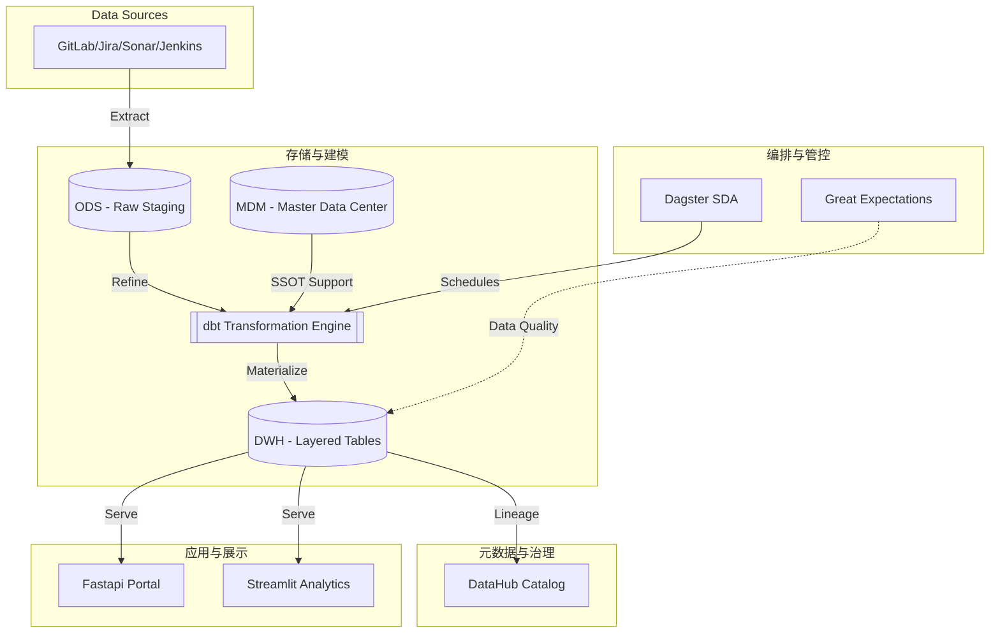

# 研发主数据与工程效能平台技术白皮书 (Technical Architecture v4.0)

> **核心理念**: 基于 Modern Data Stack (MDS) 构建，以主数据为基石，活动流为核心，通过软件定义资产 (SDA) 驱动全链路自动化编排，实现工程效能与研发成本的透明化治理。

## 1. 架构概览与演进 (Architecture Overview & Vision)

在研发数字化转型过程中，“数据烟囱”和“口径不一”是核心痛点。本系统已由传统的 ETL 演进为基于 **Modern Data Stack (MDS)** 的软件定义资产架构，通过 **Dagster** 驱动，实现从数据采集到业务洞察的端到端可验证链路。
- **从工具导向转向实体导向**: 不再关注“GitLab 里的 Commit”，而是关注“开发者 A 在项目 P 上的投入”。
- **从计算导向转向治理导向**: 通过主数据预对齐，确保所有指标计算基于同一套“人、财、组织”底座。

### 全链路流转逻辑：
1. **编排层 (Orchestration Layer)**: 由 **Dagster** 统一管理任务调度，通过 SDA (Software Defined Assets) 实现数据血缘驱动的自动化更新。
2. **采集层 (Collection Layer)**: 插件化适配器 (`BaseWorker`)，基于 Airbyte/Custom Plugin 执行外部 API 高保真同步。
3. **转换层 (Transformation Layer)**: 利用 **dbt** 构建五层数仓模型，实现逻辑封装与分析逻辑下沉。
4. **治理层 (Governance & Metadata)**: 集成 **DataHub** 和 **Great Expectations**。提供自动化全链路血缘视图与数据质量实时监控。
5. **交互层 (Presentation Layer)**:
    * **Interactive Portal**: FastAPI + Vanilla JS 高性能管理门户。
    * **Advanced Analytics**: Streamlit 驱动的深度业务透视看板。

## 2. “五层五位”数据架构设计 (Data Layering)

系统采用严格的五层分层架构，通过 **dbt** 进行物理隔离与逻辑抽象。

* **L0: ODS (Operational Data Store - 原始归集层)**
  * **定位**: 统一接入外部系统，实现原始 API 数据的高保真镜像同步 (`stg_` 模型)。
* **L1: MDM (Master Data Management - 主数据层) 🌟**
  * **定位**: 全系统的“单一事实源 (SSOT)”。身份归一化 (`mdm_identities`)、资源拓扑与成本配置。业务逻辑变动（如人员调岗）只需在 MDM 更新，所有下层 Fact 表自动感知。
* **L2: INT (Intermediate - 通用引擎层)**
  * **定位**: 引擎化抽象。建立“统一活动流引擎 (`int_unified_activities`)”和“统一工作项引擎 (`int_unified_work_items`)”。执行研发财务分类 (CapEx/OpEx) 的核心逻辑推导。
* **L3: DWS (Data Summary Service - 公共汇总层)**
  * **定位**: 以实体（人、项目、时间）为维度的指标预聚合（如 DORA 核心指标、SPACE 效能）。
* **L4: ADS/MARTS (Application Data Store - 应用集市层)**
  * **定位**: 直面 BI 看板和管理决策（如 `fct_capitalization_audit`, `fct_talent_radar`）。

## 3. 核心设计理念与创新点 (Core Concepts & Innovations)

### 3.1 软件定义资产 (Software-Defined Assets)
系统摒弃了“先跑任务，再产出文件”的模式，转而使用 Dagster 定义资产的最终状态。
* **血缘透明**: 每一项指标（如 ROI）都可以追溯到其依赖的 dbt 模型，进而追溯到原始 API 数据。
* **按需更新**: 智能识别已过期资产，仅重跑受变动影响的部分，极大节省 IO 资源。通过 Partition 实现按日/按周重跑时间窗口，或基于 Fastapi Webhook 监听事件触发局部刷新。

### 3.2 跨系统身份归一化与 SCD Type 2
* **Identity Resolution**: 针对开发者跨系统账号（如 `alice.w` 与 `alice_wang`），系统建立权重算法自动挂载，并在 dbt 计算中通过 `int_identity_alignment` 无感知替换为统一的 `global_user_id`。
* **SCD Type 2 (渐变维)**: 核心主数据采用“生效/失效日期”管理模式。结合乐观锁机制，确保历史效能数据在人员调岗后依然可准确回溯。

### 3.3 研发活动“事件化”与财务核算 (Value Stream Accounting)
所有的研发行为被标准化为事件流：`[时间戳, 发起者, 活动类型, 目标实体, 影响分值, 元数据]`。
基于此统一流，系统通过语义识别关联任务进行自动财务核算：
* **资本化 (CapEx)**: 挂载需求、功能的变更。
* **费用化 (OpEx)**: 修复 Bug、处理债务、线上支持。
结合 `mdm_calendar` 模型扣除节假日，并在统计效能时引入 AI 对合并代码的复杂度与紧急修复进行权重修正。

## 4. 健壮性与治理架构 (Governance & Testing Guardrails)

系统通过“双重守卫”机制建立极高密度的质量门禁，并依赖于全链路元数据透明化：

### 4.1 数据质量监控 (Data Quality Guard)
集成 **Great Expectations (GE)** 在数据进入核心表前进行颗粒度校验：
* **非空校验**: 确保关键 ID（如 `global_user_id`）不丢失。
* **一致性校验**: 确保 dbt 转换后的产出物符合业务常识（如 ROI 不能为负）。

### 4.2 架构测试 (Architecture Test & Unittests)
* **单元测试 (Unit Tests)**: 针对转换层 (`int_`) 的复杂逻辑（如财务分类、DORA Leadtime 计算）编写 Mock 案例，确保代码修改不破坏业务定义。
* **架构测试 (dbt Schema Tests)**: 校验主键唯一性、关系引用的回溯以及值集的枚举规范（例如 `audit_status`）。
* **命名解耦机制**: 新版测试架构将强管理模型增加了 `GTM` 前缀（Go-to-Market / Governance Test Model），消除业务与测试框架（如 pytest）的类名收集冲突。

### 4.3 拓展接入 (Extensibility & Registration)
新增外部采集系统只需通过继承 `BaseWorker` 并注册至 `PluginRegistry`。旧有冗余采集器已全面废弃，统一推送到标准化队列引擎进行抽取（Webhook 或 Scheduled Partitions）。

## 5. 最终技术栈 (Tech Stack Summary)
* **Orchestrator**: Dagster (SDA)
* **Transformation**: dbt (Data Build Tool) 1.8+
* **Database**: PostgreSQL 16 (支持向量化与 JSONB 索引)
* **Validation**: Great Expectations
* **Governance**: DataHub
* **Messaging**: RabbitMQ / SSE
* **Backend**: FastAPI (Python 3.11+)
* **Frontend**: Vanilla JS (Portal) + Streamlit (Analytics)

---

## 结语
本架构通过“分而治之”的设计方案，利用“主数据对齐”解决跨工具墙壁，利用“五层数据仓库”隔离清洗与分析逻辑，最终将不稳定的碎片化工具数据转化为高可信、可穿透、可扩展的工程研发资产底座。
