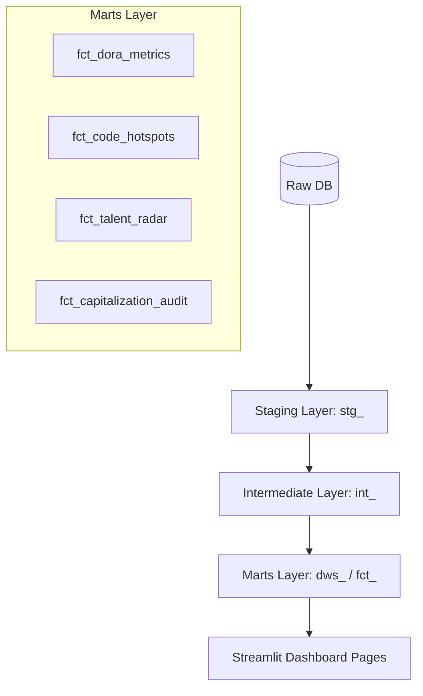

# Engineering Metrics Architecture (v3.0)

> **Version**: 3.0  
> **Last Updated**: 2026-01-04  
> **Scope**: dbt Layered Analytics, Flow Framework, SPACE, DORA, Code Hotspots, Talent Radar, Capitalization Audit

## 1. Overview

This document defines the comprehensive engineering metrics system implemented in the DevOps platform. It features a robust dbt-based data warehouse architecture (Source -> Staging -> Intermediate -> Marts) to ensure data lineage, quality, and multi-dimensional analysis.

The system is built on four theoretical pillars:

1. **ELOC 2.0 (GitPrime Style)**: Quantifying engineer output with impact and rework contexts.
2. **DORA (Google)**: Measuring delivery speed (including wait/work breakdown) and stability.
3. **SPACE (Microsoft/GitHub)**: Balancing productivity across 5 dimensions.
4. **Value Stream Accounting**: Automated R&D Capitalization (CapEx vs OpEx).

---

## 2. Core Metrics Definitions

### 2.1 ELOC 2.0 (Equivalent Lines of Code)

Standardizes "effort" by weighting code changes based on context, reducing the bias of raw LOC.

| Metric | Business Value | Logic |
| :--- | :--- | :--- |
| **ELOC Score** | Coding volume. | `(Additions + Deletions) * FileWeight * ContextWeight` |
| **Impact Score** | Value of work. | `ELOC Score * LegacyFactor` |
| **Churn Lines** | Rework/Waste. | Lines modified within **21 days** of previous commit. |
| **Active Days** | Focus consistency. | Count of distinct days with at least one commit. |

### 2.2 DORA Metrics (Refined)

Moving beyond totals to lifecycle bottleneck identification.

* **Deployment Frequency**: Success releases to production per month.
* **Lead Time for Changes (Refined)**:
  * **Pickup Delay**: Time from MR creation to first human review. (Measures Responsiveness).
  * **Work Duration**: Time from first review to merge. (Measures Collaboration Complexity).
* **Change Failure Rate**: Success vs Failed deployments at production environment.
* **MTTR**: Mean Time to Recovery (based on Incident-labeled issues).

### 2.3 Talent & Knowledge Radar

Quantifying technical leadership and organizational risk.

* **Ownership %**: Calculated by `int_file_knowledge_ownership` based on historical code contributions per file/directory.
* **Bus Factor**: Identifying sub-systems where a single contributor owns >80% of the knowledge.
* **Talent Archetypes**:
  * **Domain Specialist**: High knowledge depth in specific repositories.
  * **Collaborative Leader**: High review count and cross-team impact.
  * **Reliable Contributor**: Consistent delivery output.

### 2.4 Code Hotspots (Michael Feathers F-C Analysis)

Identifying high-risk technical debt through `fct_code_hotspots`.

* **Risk Factor**: `Churn_90d * log(Estimated_LOC + 2)`.
* **Risk Zones**:
  * **RED_ZONE**: High Churn + High Complexity. Critical Technical Debt.
  * **AMBER_ZONE**: Complex but stable (Core modules) or Simple but volatile.
  * **CLEAR**: Low risk maintenance files.

### 2.5 R&D Capitalization Audit

Automated financial classification of engineering effort.

* **CapEx (Capital Expenditure)**: Effort spent on Features, Requirements, and Epics.
* **OpEx (Operating Expenditure)**: Effort spent on Bugs, Refactoring (Technical Debt), and Support.
* **Audit Status**: `AUDIT_READY` vs `HIGH_CAPEX_INSPECTION_REQUIRED` (for rate > 80%).

---

## 3. Implementation Architecture

### 3.1 Data Flow (dbt Layered)

### 3.2 Model Mapping Structure

| Dashboard Page | Primary dbt Model |
| :--- | :--- |
| `1_DORA_Metrics.py` | `fct_dora_metrics` |
| `6_Capitalization_Audit.py` | `fct_capitalization_audit` |
| `8_Talent_Radar.py` | `fct_talent_radar` |
| `15_Michael_Feathers_Code_Hotspots.py` | `fct_code_hotspots` |

---

## 4. Key Configuration

* **DORA Benchmarks**: Elite (< 1 day lead time), High (< 1 week), etc.
* **Bus Factor Threshold**: Warning triggered when single-user ownership > 80%.
* **Risk Factor Ceiling**: Files with Risk Factor > 40 are flagged as RED_ZONE.
